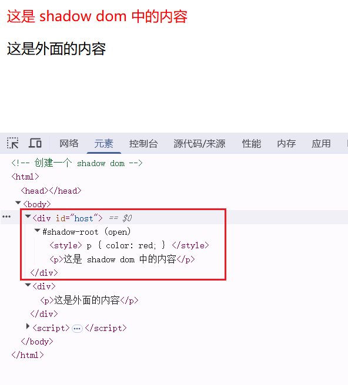
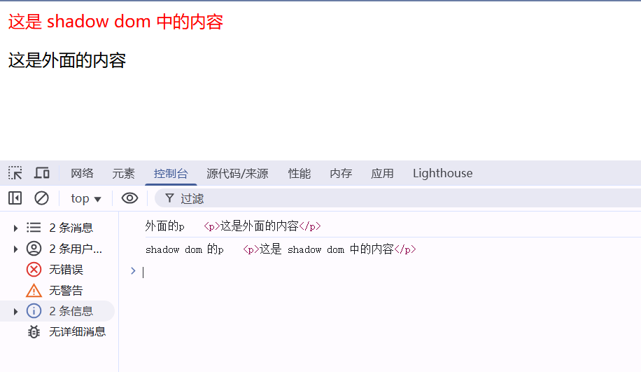

# Shadow DOM

**Shadow DOM（Shadow Document Object Model）** 是 Web Components 标准的核心技术之一，它允许将**封装的 DOM 子树**附加到常规 DOM 树中，实现**样式隔离**和**DOM 隔离**。Shadow DOM 中的元素不会影响到外面的元素，外面的元素也不会影响到内部的。通过 Shadow DOM，开发者可以创建独立于主文档的组件，避免样式和脚本的全局污染。

---

### **为什么需要 Shadow DOM？**
在传统前端开发中，DOM 和 CSS 是全局共享的，导致：
1. **样式冲突**：不同组件的 CSS 选择器可能互相覆盖。
2. **DOM 操作干扰**：脚本可能意外修改其他组件的 DOM 结构。
3. **代码维护困难**：全局作用域下难以管理复杂组件。

Shadow DOM 通过创建一个**隔离的 DOM 树**，解决这些问题。

---

### **Shadow DOM 的核心概念**
1. **Shadow Host**：常规 DOM 树中的节点，Shadow DOM 的挂载点。
2. **Shadow Tree**：附加到 Shadow Host 上的独立 DOM 子树。
3. **Shadow Root**：Shadow Tree 的根节点，是隔离环境的入口。

---
### **Shadow DOM 的隔离特性**
#### **1. 样式隔离**
- Shadow DOM 内的 CSS 默认不会影响外部，外部样式也不会影响内部（除非使用 `::part` 或 `::slotted` 穿透）。


#### **2. DOM 隔离**
- Shadow DOM 内部的元素对主文档不可见（如 `document.querySelector` 无法找到它们）。

---

### **如何使用 Shadow DOM？**
#### **1. 基本用法（原生 JavaScript）**
```html
<div id="host"></div>

<div>
  <p>这是外面的内容</p>
</div>


<script>
  const host = document.getElementById('host');
  // 创建 shadow dom
  const shadowRoot = host.attachShadow({ mode: 'open' });

  // 向 shadow dom 中添加内容
  shadowRoot.innerHTML = `
    <style>
      p {
        color: red;
      }
    </style>
    <p>这是 shadow dom 中的内容</p>
  `;

  console.log('外面的p', document.querySelector('p'));
  console.log('shadow dom 的p', shadowRoot.querySelector('p'));
  console.log('shadow dom', host.shadowRoot);
  // 当 mode 为 open 时，host.shadowRoot 为 shadowRoot
  // 当 mode 为 closed 时，host.shadowRoot 为 null

</script>

```

**效果**：  
- `<p>` 标签的红色样式不会影响主文档中的其他段落。
  
- 主文档无法直接通过 `document.querySelector` 访问 Shadow DOM 内部元素，可以通过 `shadowRoot.querySelector` 访问。



---

#### **2. 在 Vue/React 中使用 Shadow DOM**
虽然 Vue/React 不直接支持 Shadow DOM，但可以通过手动操作 DOM 实现。

##### **Vue 示例**
```vue
<template>
  <div ref="host"></div>
</template>

<script>
export default {
  mounted() {
    const host = this.$refs.host;
    const shadowRoot = host.attachShadow({ mode: 'open' });
    shadowRoot.innerHTML = `
      <style>p { color: blue; }</style>
      <p>Vue 中的 Shadow DOM</p>
    `;
  },
};
</script>
```

---

### **穿透 Shadow DOM 的边界**
#### **1. 插槽（Slots）**
使用 `<slot>` 标签将外部内容投影到 Shadow DOM 中。
```html
<div id="host">
  <p slot="content">我是外部的内容</p>
</div>

<script>
  const host = document.getElementById('host');
  // 创建 shadow dom
  const shadowRoot = host.attachShadow({ mode: 'open' });

  // 通过 <slot> 标签将外部内容投影到 Shadow DOM 中。
  shadowRoot.innerHTML = `
    <style>
      p {
        color: red;
      }
    </style>
    <p>
      <slot name="content"></slot>
    </p>
  `;
</script>
```

#### **2. CSS 穿透**
- **`::part`**：允许外部样式穿透 Shadow DOM，需在 Shadow DOM 中标记可暴露的部分。
  ```html
  <div id="host"></div>

  <script>
    const host = document.getElementById('host');
    const shadowRoot = host.attachShadow({ mode: 'open' });
    shadowRoot.innerHTML = `
      <p part="highlight">我是 shadow dom 中的内容</p>
    `;
  </script>

  <style>
    #host::part(highlight) { color: blue; } /* 修改 Shadow DOM 内部的样式 */
  </style>
  ```

- **`::slotted`**：样式化通过 `<slot>` 投影的内容。
  ```html
  <div id="host">
    <span slot="content">我是外部的内容</span>
  </div>

  <script>
    const host = document.getElementById('host');
    const shadowRoot = host.attachShadow({ mode: 'open' });

    shadowRoot.innerHTML = `
      <style>
        ::slotted(span) {
          color: pink;
          font-weight: bold;
        }
      </style>
      <p>
        <slot name="content"></slot>
      </p>
    `;
  </script>
  ```

---

### **实际应用场景**
1. **UI 组件库**：封装高内聚的组件（如按钮、弹窗），避免样式污染。
2. **微前端隔离**：在 qiankun 等框架中，通过 Shadow DOM 隔离子应用的样式。
3. **浏览器原生组件**：如 `<video>`、`<input>` 等标签内部使用 Shadow DOM 实现复杂 UI。

---

### **注意事项**
1. **兼容性**  
   - 现代浏览器均支持 Shadow DOM，但 IE 不支持。  
   - 可通过 [Polyfill](https://github.com/webcomponents/polyfills/tree/master/packages/shadow-dom) 兼容旧浏览器。

2. **事件冒泡**  
   - Shadow DOM 内部的事件默认不会冒泡到外部（可通过 `composed: true` 允许冒泡）：
     ```javascript
     const event = new CustomEvent('my-event', { 
       bubbles: true,      // 允许冒泡
       composed: true      // 穿透 Shadow DOM 边界
     });
     shadowRoot.dispatchEvent(event);
     ```

3. **第三方库兼容性**  
   - 某些库（如 jQuery）可能无法直接操作 Shadow DOM 内的元素。

---

### **总结**
| **特性**       | **说明**                                                                 |
|----------------|-------------------------------------------------------------------------|
| 样式隔离       | 内部样式不影响外部，外部样式默认不影响内部。                               |
| DOM 隔离       | 内部元素对主文档不可见。                                                  |
| 插槽（Slots）  | 允许外部内容投影到 Shadow DOM 中。                                        |
| 适用场景       | UI 组件、微前端隔离、高内聚功能模块。                                      |

**使用建议**：
- 在需要严格隔离的组件或微前端场景中使用 Shadow DOM。
- 结合 Web Components 标准（如 `<template>`、`<slot>`）构建可复用组件。
- 在 Vue/React 中慎用，优先使用框架自身的组件封装机制（如 Vue 的 `scoped CSS`）。