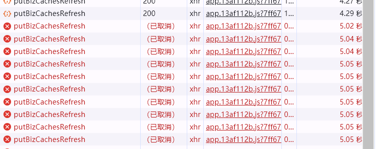

#### 浏览器并发请求限制
chrome浏览器同域名的并发请求限制数量为**6**个，也就是说，当前同一个个域名下，一旦存在等待响应的请求数量达到6个，那么后面该域名的其他请求，必须进入等待队列，待前面的请求完成后，才会被执行。
同域并发请求数量限制，不只针对接口请求，页面上的静态资源请求，包括图片，音视频，css/js文件等，都会适用同样的策略限制。


行业中，一般采用多域名/cdn模式来解决浏览器同域并发请求限制。因为浏览器并发请求限制只针对同一个域名，因此，不同域名的并发请求数量不会受限，举个例子，在浏览器同域并发请求显示数为6的前提下，页面需要同时展示7个图片，那么7个图片资源url可以分配两个不同的域名，这样，同一个域名的并发请求不超过6个，则这7个图片资源都可以同时加载出来


前端通过构建一个运行池处理并发请求
> 不过我觉得这个方法没有什么实际意义，它只是处理前端发起的并发问题，并不能解决浏览器的并发请求限制。因为浏览器并发请求限制是针对同一个域名的，因此，如果一个页面同时请求多个域名，那么浏览器并发请求限制还是会起作用。而且等待运行的时间也会被计入超时时间等待时间久的话，依旧会超时。
```
class TaskQueue {
  constructor(maxConcurrency = 5) {
      this.tasks = []; // 存储待执行的任务
      this.running = 0; // 当前正在运行的任务数
      this.maxConcurrency = maxConcurrency; // 最大并发数
  }

  add(taskFn) {
      this.tasks.push(taskFn);
      this.schedule();
  }
  // 检查并执行队列中的任务，确保并发数不超过设定的最大值

  async schedule() {
      while (this.running < this.maxConcurrency && this.tasks.length > 0) {
          const task = this.tasks.shift();
          this.running++;
          try {
              await task();
          } catch (error) {
              console.error('Task failed:', error);
          } finally {
              this.running--;
              this.schedule(); // 递归调度下一个任务
          }
      }
  }
}

// 使用示例
const queue = new TaskQueue(3); // 设置最大并发为3

for (let i = 0; i < 10; i++) {
  queue.add(async () => {
      console.log(`开始执行任务 ${i}`);
      await new Promise(resolve => setTimeout(resolve, Math.random() * 1000));
      console.log(`结束执行任务 ${i}`);
  });
}
```


#### 浏览器请求等待时间会计算到timeout中

当浏览器发送请求并设置了一定的超时时间，‌如果在请求等待服务器响应的过程中，‌等待时间会被计入超时时间内。‌这意味着，‌如果请求在等待服务器处理或响应的过程中超过了设置的超时时间，‌浏览器可能会主动中断该请求，‌显示请求已被取消（‌canceled）‌或出现超时错误。‌这种情况尤其在多个请求同时发起时更为明显，‌因为浏览器会限制同一时间处理请求的最大数量，‌导致一些请求被挂起，‌等待前面请求处理完毕后才能继续发送给服务器。‌在这个过程中，‌挂起的请求的等待时间仍然会计入超时时间之内。‌

此外，‌即使是在请求被挂起的状态下，‌如果等待时间过长，‌超过了设置的超时限制，‌浏览器也可能会中断该请求，‌即使服务器还未开始处理该请求。‌这种情况下，‌服务器可能完全不知道浏览器已经中断了请求，‌因为浏览器在超时之前并没有向服务器发送任何数据或指令。‌



