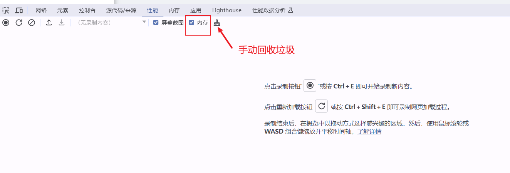

### 什么是内存泄漏  
 **不再用到的内存，没有及时释放，就叫做内存泄漏。**    
 JS有自己的内存回收机制，可以确定哪些变量不再需要，并将其清除，但这并不代表着开发者可以不关心内存管理。你还是需要关注内存占用：那些不在需要但依旧占用内存的值，必须手动解除引用     
 比如说：   
 ```
let arr = [1, 2, 3, 4, 5];
console.log('hello world');
arr = null;
 ```
 变量arr引用了数组[1,2,3,4,5],后面的代码不再需要它，就需要手动释放这个内存。即将arr重置为null，使其引用次数为0。


在了解垃圾回收算法之前，我们要先明白JS的内存管理机制
### js内存管理机制   
JavaScript 内存管理机制和内存的生命周期是一一对应的。   
也就是**分配内存、使用内存、释放内存**。   
#### 内存分配   
JS在定义变量时会自动分配内存   
#### 内存使用   
内存的使用实际上是对分配的内存进行读写的过程。比如说赋值（写入一个变量或者对象的属性值）、传参（传递函数的参数）   
```
// 写入内存
number = 234;
// 读取 number 和 func 的内存，写入 func 参数内存
func(number);
```  
#### 内存回收 （Garbage Collection）
在JavaScript中，"GC"代表垃圾回收（Garbage Collection），它是一种自动内存管理机制，负责识别不再使用的对象，并释放其使用的内存。它可以清除绝大多数的垃圾内存，清除不了时需要我们手动回收。

 ### 垃圾回收算法   
 #### 1.引用计数
 ##### 原理
 js引用引擎中有一个“引用表”，记录着内存中所有资源的引用次数，表示有多少地方引用了该对象。当这个引用次数是0（零引用），就代表这个值已经不会再用，对象可以被回收。当一个值不再被需要了，但是他的引用值却不是0，垃圾回收机制无法释放这块内存，这个时候就会导致内存泄漏。 
 + 当一个对象被创建时，它的引用计数初始化为1。
 + 每当一个新的引用指向该对象时，其引用计数加1。
 + 当一个引用失效或者被重新赋值时，其引用计数减1。
 + 如果引用计数降为0，则表明没有引用再指向该对象，此时可以安全地释放该对象所占用的内存。 
 
###### 一个例子 
 ```
   var o = {
      a: {
         b: 2
      }
   };
 ```
两个对象被创建，a 作为另一个的属性被引用，另一个被分配给变量o
此时 o 和 a 的引用次数都是1 ，都不会被回收

``` var o2 = o; ```
创建了一个新的变量 o2，它指向与 o 相同的对象。  
此时，o 对象的引用计数从 1 增加到 2，因为现在有两个变量 (o 和 o2) 都指向同一个对象。
a 对象的引用计数仍然为 1，因为它只被 o 中的一个属性引用  

```o = 1;```
将 o 的值改为数字 1。
这意味着 o 不再引用原来的对象，而是指向一个新的数字值。
因此，原来 o 指向的对象的引用计数从 2 减少到 1，因为现在只有 o2 还在引用这个对象。
a 对象的引用计数仍然为 1，因为它仍然被 o2 中的 a 属性引用。

```var oa = o2.a; ```
创建了一个新的变量 oa，它指向 o2 中的 a 属性。
此时，a 对象的引用计数从 1 增加到 2，因为现在有两个变量 (o2 和 oa) 都指向同一个对象。
o2 指向的对象的引用计数仍然为 1，因为只有 o2 还在引用这个对象。

```o2 = "yo";``` 
将 o2 的值改为字符串 "yo"。
这意味着 o2 不再引用原来的对象，而是指向一个新的字符串值。
因此，原来 o2 指向的对象的引用计数从 1 减少到 0，因为现在没有变量引用这个对象。
此时，a 对象的引用计数为 1，因为它仍然被 oa 引用。

```oa = null;``` 
将 oa 的值设为 null。
这意味着 oa 不再引用 a 对象。
因此，a 对象的引用计数 减少到 0，垃圾收集器将会回收这个对象。

##### 优点
+ 简单高效
  实现相对简单，不需要复杂的分析即可快速确定对象是否可以被释放。
+ 即时释放
  一旦引用计数归零，对象立即被释放，避免了垃圾收集器周期性的暂停
##### 缺点
+ 额外开销
  每个对象都需要维护一个引用计数，这会增加一定的内存和计算开销。
+ 循环引用问题
  如果两个或多个对象互相引用对方，它们的引用计数永远不会降到0，即使这些对象实际上已经不再被需要，也会导致内存泄漏。
+ 不适用场景
  对于频繁改变所有权的对象，引用计数可能会导致性能下降。

###### 循环引用例子与解决方法
在下面的例子中，两个对象被创建，并互相引用，形成了一个循环，引用计数算法考虑到它们互相都有至少一次引用，所以它们不会被回收,这里通过手动解除引用的方式回收。
 ```
   // 创建两个对象 a 和 b
   let a = {
      name: 'object A'
   };

   let b = {
      name: 'object B'
   };

   // 形成循环引用
   a.b = b;
   b.a = a;

   // 检查循环引用
   console.log(a.b.a.name); // 输出 "object B"
   console.log(b.a.b.name); // 输出 "object A"

   // 清除引用
   a.b = null;
   b.a = null;

   // 再次检查
   console.log(a.b); // 输出 undefined
   console.log(b.a); // 输出 undefined
 ```
 解决方法：   
 + 使用弱引用（Weak References）
  弱引用不会增加对象的引用计数，因此不会阻止对象被销毁
 + 手动解除引用
  在某些情况下，可以通过显式地解除对象之间的引用关系来避免循环引用。

>强引用和弱引用
ES6 把引用有区分为强引用和弱引用，这个目前只有再 Set 和 Map 中才有。
强引用才会有引用计数叠加，只有引用计数为 0 的对象的内存才会被回收，所以一般需要手动回收内存（手动回收的前提在于标记清除法还没执行，还处于当前执行环境）。
而弱引用没有触发引用计数叠加，只要引用计数为 0，弱引用就会自动消失，无需手动回收内存。

 #### 2.标记清除   
 核心：**可达内存被标记，其余的被当作垃圾回收**     
 ##### 原理   
 这种方法分为两个阶段：标记（Mark）和清除（Sweep）。 

 1.标记阶段
 + 根节点扫描：从一组称为“根”的对象开始，这些根对象通常是全局变量、执行上下文中的局部变量等。
 + 可达性分析：从根节点出发，沿着对象图进行深度优先或广度优先搜索，对所有可达的对象进行标记。
 + 未标记的对象被视为垃圾：那些没有被标记的对象表示不可达，即不再被任何活动代码引用，因此可以被回收。

2.清除阶段：
 + 回收未标记的对象：垃圾收集器会遍历整个堆内存，释放那些在标记阶段未被标记的对象所占用的空间。
 + 内存整理：在一些实现中，还会进行内存碎片整理，将存活的对象移动到连续的内存区域，以减少内存碎片。
 
  

###### 一个例子：
在这个示例中，我们创建了两个对象 obj1 和 obj2，并形成了循环引用。然后我们断开了这些引用，并通过调用 gc() 函数强制触发垃圾回收（在现代浏览器中通常不需要这样做）。标记清除算法将识别这两个对象为不可达，并将其回收。
```
function markAndSweepExample() {
    let obj1 = { value: 1 };
    let obj2 = { value: 2 };

    // 创建循环引用
    obj1.next = obj2;
    obj2.next = obj1;

    // 断开引用
    obj1 = null;
    obj2 = null;

    // 强制垃圾回收
    // 注意：在实际应用中，通常不需要手动调用垃圾回收
    if (typeof gc === 'function') {
        gc(); // 调用垃圾回收函数
    }
}

markAndSweepExample();
```

##### 优点   
+ 自动管理
  不需要程序员手动管理内存。
+ 有效处理循环引用
   通过可达性分析，可以有效地处理循环引用的问题。

##### 缺点
+ 性能开销
  标记和清除过程会导致程序暂停，影响应用程序的响应时间。
+ 内存碎片
  如果没有内存整理步骤，可能会产生内存碎片，导致大块连续内存无法分配。
+ 效率问题
  标记和清除过程可能比较耗时，特别是在大规模数据结构中。


### 内存泄漏的一些场景   
#### 1.全局变量   
   在**非严格模式下**当引用未声明的变量时，会在全局对象中创建一个新变量。在浏览器中，全局对象将是window  
   ```
   function foo（arg）{ 
    bar =“some text”; // bar将泄漏到全局.
   }
   ```
   全局变量根据定义无法被垃圾回收机制收集!!(请确保将其指定为null或在完成后重新分配它)
###### 案例
错误写法：
```
<template>
  <div id="home">这里是首页</div>
</template>
<script>
  export default {
    mounted() {
      window.test = {
        // 此处在全局window对象中引用了本页面的dom对象
        name: 'home',
        node: document.getElementById('home'),
      }
    },
  }
</scrip
```
解决方法：
```
destroyed () {
  window.test = null // 页面卸载的时候解除引用
 }
```
#### 2.被遗忘的定时器 setTimeout/setInterval  
   比如说，在组件中moutend里开启定时器，组件销毁的时候，定时器依旧在运行，里面的内存会被浏览器认为这只必须的内存而无法回收它们。   
   这个时候，我们就需要在组件销毁时，及时清除定时器。
###### 案例
错误写法：
```
let counter = 0;

const intervalId = setInterval(function() {
    console.log("Count:", counter++);
}, 1000);

```
正确写法：
```
// 定义一个简单的计数器
let counter = 0;

// 使用 setInterval 创建一个定时器
let intervalId = null;

// 创建定时器
intervalId = setInterval(function() {
    console.log("Count:", counter++);
}, 1000);

// 清除定时器
function clearTimer() {
    if (intervalId) {
        clearInterval(intervalId);
        intervalId = null;
    }
}

// 假设这是在一个 Vue.js 组件中
export default {
   methods: {
      startTimer() {
         intervalId = setInterval(() => {
            console.log("Count:", counter++);
         }, 1000);
      },
      clearTimer() {
         if (intervalId) {
            clearInterval(intervalId);
            intervalId = null;
         }
      }
   },
   mounted() {
      this.startTimer();
   },
   beforeDestroy() {
      this.clearTimer();
   }
}
```
#### 3.监听事件未移除或未被正确移除
> 包括 MutationObserver监听未disconnect 、 addEventListener监听未移除、 全局EvenBus监听没有off、自定义指令中的监听未移除、echart未dispose 或 echart监听事件未正确移除等
###### 案例一: 未移除事件监听
错误写法：
   ```
   mounted() {
      this.observer = new MutationObserver((mutations) => {
         ......
      })
      let el = document.getElementsByClassName('main')[0]    
      this.observer.observe(el, { attributes: true})
   },
   ```
正确写法：
   ```
   mounted() {
      this.observer = new MutationObserver((mutations) => {
         ......
      })
      let el = document.getElementsByClassName('main')[0]    
      this.observer.observe(el, { attributes: true})
   }
   destroyed() {
      this.observer.disconnect()
   }
   ```
###### 案例二: 移除监听时，参数不对应
错误写法：
   ```
   mounted() {
      window.addEventListener('scroll', this.handleScroll2, true);
   },
   destroyed: function () {
      window.removeEventListener('scroll', this.handleScroll2); 
    }
   ```  
正确写法： 
   ```
   mounted() {
      window.addEventListener('scroll', this.handleScroll2, true);
   },
   destroyed: function () {
      window.removeEventListener('scroll', this.handleScroll2, true); 
    }
   ```  

###### 案例三: 监听事件为匿名函数
错误写法：
   ```
   mounted() {
      document.addEventListener('click', e => {
         if (!this.$el.contains(e.target)) {
         this.isShowSelect = false
         }
      })
   },
   destroyed() {
      document.removeEventListener('click'); 
   }
   ```
正确写法：
   ```
   export default {
      data() {
         return {
            isShowSelect: true,
            clickHandler: null // 保存事件处理函数的引用
         };
      },
      mounted() {
         this.clickHandler = (e) => { // 定义事件处理函数
            if (!this.$el.contains(e.target)) {
               this.isShowSelect = false
            }
         };
         
         document.addEventListener('click', this.clickHandler); // 添加事件监听器
      },
      destroyed() {
         if (this.clickHandler) {
            document.removeEventListener('click', this.clickHandler); // 移除事件监听器
         }
      }
   }
   ```

###### 案例四: 自定义指令未移除监听
错误写法：
```
directives: {
   close: {
      inserted(el, binding, vnode) {
         window.addEventListener('click', function(e) {
            if (e.target.className.includes('h-icon-right') || e.target.className.includes('h-checkbtn-icon') || e.target.className.includes('h-icon-android-close')) {
               return false
            }
            if (!el.contains(e.target)) {
               if (!vnode.context.hideInput) {
                  vnode.context.isShow = false
               }
            }
         })
      }
   }
}
```
正确写法：
```
export default {
   directives: {
      close: {
         inserted(el, binding, vnode) {
            const clickHandler = function(e) {
               if (e.target.className.includes('h-icon-right') || e.target.className.includes('h-checkbtn-icon') || e.target.className.includes('h-icon-android-close')) {
                  return false
               }
               if (!el.contains(e.target)) {
                  if (!vnode.context.hideInput) {
                     vnode.context.isShow = false
                  }
               }
            };

            window.addEventListener('click', clickHandler);

            // 保存事件处理函数的引用
            vnode.context.$clickHandler = clickHandler;
         }
      }
   },
   beforeDestroy() {
      if (this.$clickHandler) {
         window.removeEventListener('click', this.$clickHandler);
      }
   }
}
```  
#### 4.闭包循环引用
下面的例子返回的对象包含一个对 createCounter 函数的引用。
createCounter 函数又包含了对 count 变量的引用。
这种情况下，即使 counter 变量被设置为 null，但由于 savedCounter 仍然持有对 createCounter 函数的引用，而 createCounter 函数又持有对 count 的引用，导致整个闭包无法被垃圾回收器回收，从而产生内存泄漏。
错误写法：
```
function createCounter() {
    let count = 0;

    function increment() {
        count++;
        console.log(count); // 形成闭包
    }

    // 返回一个对象，包含 increment 方法和一个指向外部函数的引用
    return {
        increment: increment,
        referenceToOuterFunction: createCounter // 导致循环引用
    };
}

// 创建计数器
const counter = createCounter();

// 使用计数器
counter.increment(); // 输出 1
counter.increment(); // 输出 2

// 保存计数器的引用
let savedCounter = counter;

// 清除计数器的引用
counter = null;
```

正确代码：
```
function createCounter() {
    let count = 0;

    function increment() {
        count++;
        console.log(count);
    }

    return {
        increment: increment
    };
}

// 创建计数器
const counter = createCounter();

// 使用计数器
counter.increment(); // 输出 1
counter.increment(); // 输出 2

// 保存计数器的引用
let savedCounter = counter;

// 清除计数器的引用
counter = null;

// 明确清除保存的引用
savedCounter = null;
```
#### 5.游离的DOM
###### 案例一: DOM 与 对象循环引用
如果 DOM 元素被 JavaScript 对象引用，而这些 JavaScript 对象又引用了 DOM 元素，就会形成循环引用，从而导致内存泄漏。下面是一个使用 DOM 元素和 JavaScript 对象之间的循环引用导致内存泄漏的例子。
错误写法：
```
// 创建一个简单的 DOM 元素
const element = document.createElement('div');
element.textContent = 'Hello, World!';
document.body.appendChild(element);

// 创建一个 JavaScript 对象并将其与 DOM 元素关联
const obj = {
    message: 'This is a message.',
    domElement: element
};

element.data = obj; // DOM 与 js对象 形成循环引用

// 即使 element 和 obj 变量被设置为 null，由于 DOM 元素上的 data 属性仍然持有对 obj 的引用，整个结构无法被垃圾回收器回收，从而导致内存泄漏。
element = null;
obj = null;

```
正确写法：
```
// 创建一个简单的 DOM 元素
const element = document.createElement('div');
element.textContent = 'Hello, World!';
document.body.appendChild(element);

// 创建一个 JavaScript 对象并将其与 DOM 元素关联
const obj = {
    message: 'This is a message.',
    domElement: element
};

// 将 JavaScript 对象附加到 DOM 元素上
element.data = obj;

// 清除 DOM 元素的引用
element.data = null; // 明确清除 DOM 元素上的引用

// 移除 DOM 元素
document.body.removeChild(element);

// 清除 DOM 元素和 JavaScript 对象的引用
element = null;
obj = null;
```

###### 案例二: v-if控制显隐造成的内存泄漏
下面的示例中，我们加载了一个带有非常多选项的选择框，当选择框被隐藏时 (showChoices 为 false)，Choices 实例仍然存在，因为没有显式地销毁它。这可能会导致内存泄漏，特别是当 choices 数组非常大时，会占用大量内存。
错误写法：
```
<template>
<div id="app">
  <button v-if="showChoices" @click="hide">Hide</button>
  <button v-if="!showChoices" @click="show">Show</button>
  <div v-if="showChoices">
    <select id="choices-single-default"></select>
  </div>
</div>
</template>

<script>
  export default {
    data() {
      return {
        showChoices: true,
      }
    },
    mounted: function () {
      this.initializeChoices()
    },
    methods: {
      initializeChoices: function () {
        let list = []
        // 我们来为选择框载入很多选项，这样的话它会占用大量的内存
        for (let i = 0; i < 1000; i++) {
          list.push({
            label: 'Item ' + i,
            value: i,
          })
        }
        // Choices 是一个用于创建选择框的 JavaScript 库, 这里用来创建一个可搜索的选择框
        new Choices('#choices-single-default', {
          searchEnabled: true,
          removeItemButton: true,
          choices: list,
        })
      },
      show: function () {
        this.showChoices = true
        this.$nextTick(() => {
          this.initializeChoices()
        })
      },
      hide: function () {
        this.showChoices = false
      },
    },
  }
</script>
```

正确写法：
为了防止内存泄漏，我们需要在选择框被隐藏时销毁 Choices 实例。这可以通过调用 destroy 方法实现。
```
<div id="app">
  <button v-if="showChoices" @click="hide">Hide</button>
  <button v-if="!showChoices" @click="show">Show</button>
  <div v-if="showChoices">
    <select id="choices-single-default"></select>
  </div>
</div>

<script>
  export default {
    data() {
      return {
        showChoices: true,
        choicesSelect: null
      }
    },
    mounted: function () {
      this.initializeChoices()
    },
    methods: {
      initializeChoices: function () {
        let list = []
        for (let i = 0; i < 1000; i++) {
          list.push({
            label: 'Item ' + i,
            value: i,
          })
        }
         // 在我们的 Vue 实例的数据对象中设置一个 `choicesSelect` 的引用
        this.choicesSelect = new Choices("#choices-single-default", {
          searchEnabled: true,
          removeItemButton: true,
          choices: list,
        })
      },
      show: function () {
        this.showChoices = true
        this.$nextTick(() => {
          this.initializeChoices()
        })
      },
      hide: function () {
        this.showChoices = false
        if (this.choicesInstance) {
          this.choicesInstance.destroy()
          this.choicesInstance = null
        }
      },
    },
  }
</script>
```


### 内存泄漏的分析方法
Chrome DevTools
#### 性能 Performance
 

#### 内存 Memory


参考：
http://segmentfault.com/a/1190000039132414