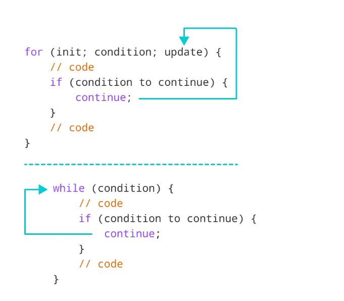

[TOC]
### 《你不知道的JavaScript（中）》学习草纸
#### 1.搞懂JS的 ++a 与 a++
###### a++

```
var a = 1
var b = a++
console.log(a, b)  // 2  1
```
> var b = a++
> 先把a赋值给b，再对a进行加1操作

###### ++a

```
var a = 1
var b = ++a
console.log(a, b)  // 2  2
```
> var b = ++a
> 先对a进行加1操作,再把新的a赋值给b

###### 一个例子
```
var f = 1
console.log(f + f++ + ++f + f++ + ++f)  // 13
//          1 + 1   + 3   + 3   + 5
```
> 第一步：f = 1
> 第二步：f = 2， f++ 是 1 
> 第三步：f = 3， ++f 是 3
> 第四步：f = 4， f++ 是 3
> 第五步：f = 5， ++f 是 5

总结来说：  
**a++返回的是** ++ 操作之前的 **旧值**
  **++a返回的是** ++ 操作之后的  **新值**  


#### 2.JS的标签语句
foo是bar()的标签：
```
{
  foo: bar()
}
```
标签为foo的循环（外层循环）：
```
foo: for (var i = 0; i < 4; i++) {
  for (var j = 0; j < 4; j++) {
    if (j == i) {
      continue foo; // 跳到foo的下一个循环
    }
    if ((j * i) / 2 == 1) {
      continue; // 继续内层循环
    }
    console.log(i, j);
  }
}
// 1 0
// 2 0
// 3 0
// 3 1
// 3 2
```

跳出标签foo所在的循环：
```
foo: for (var i = 0; i < 4; i++) {
  for (var j = 0; j < 4; j++) {
    if ((i * j) >= 3) {
      console.log("stopping",i,j)
      break foo
    }
    console.log(i, j);
  }
}
// 0 0
// 0 1
// 0 2
// 0 3
// 1 0
// 1 1
// 1 2
// stopping 1 3
```

#### 3.JS的标签语运算符优先级
+ && 高于 || 高于 ?:
+ && 和 || 是左关联， ?: 是 右关联  
+ 与其它语言不同的一点是，在js中 && 和 || 并不是返回true or false：
  **&& 左侧为true时，返回右侧的内容；  
  || 左侧为true时，返回左侧的内容。**

#### 4.switch
##### 基础用法
表达式 n 与 case 表达式 逐一比较，匹配就执行后面的代码，直到遇到 break 或者 switch 表达式结束。 default 后面是 所有 switch 情况外的 case。
```
switch(n){
    case 1:
        执行代码块 1
        break;      
    case 2:      
        执行代码块 2      
        break;      
    default:
        n 与 case 1 和 case 2 不同时执行的代码
}
```
如果 default 不是 switch 代码块中最后一个 case，要记得用 break 结束默认 default。
```
switch(n){
    default:
        n 与 case 1 和 case 2 不同时执行的代码
        break;
    case 1:
        执行代码块 1
        break;      
    case 2:      
        执行代码块 2         
}
```
一个例子： 
```
var text;
switch (3) {
  default:
    text = "期待周末";
    break;
  case 6:
    text = "今天是周六";
    break;
  case 0:
    text = "今天是周日";
}
console.log(text) // 期待周末
```
##### switch中是各种表达式时
> 需要注意的是，n 与 case 的比较 与 === 是一致的 ，所以当switch中是简单值时，没什么问题，但当switch中是各种表达式时，它会将表达式的结果与 true 进行比较。 
```
var x = "42"
switch(true) {
  case x == 10:
    console.log('--1---');
    break;
  case x == 42:
    console.log('---2--') //---2--
    break;
  default:
    console.log('---3---')
}
```
##### switch表达式使用 || 或 && 时
当使用 || 或 && 进行判断 时，就需要注意他们返回的不是true or false ，需要用表达式强制转换为 true or false，如下： 
 ==*表达式  a || b == 10  的 优先级是 ， a || (b == 10)*==
 
```
var a = "hello world";
var b = 10;
switch(true) {
  case !!(a || b == 10):
    console.log('1111') //1111
    break
  default:
    console.log('2222')
}
```
