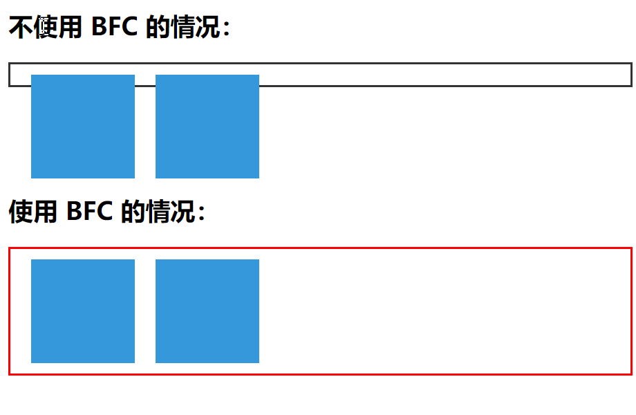

## CSS小贴士
### 1.BFC
BFC（Block Formatting Context，块级格式化上下文）是CSS中的一种渲染模式，它定义了块级盒子的布局方式以及它们如何相互作用。**BFC是一个独立的渲染区域，其中的元素只会影响该区域内的布局，而不会影响到区域外的其他元素**。

###### BFC的特点:
+ 隔离性：BFC内部的元素不会影响外部元素的布局。
+ 浮动元素的影响：浮动元素不会影响BFC内部的非浮动元素。
+ 清除浮动：BFC可以作为浮动元素的容器，帮助清除浮动。
+ 计算高度：BFC的高度由其内容决定，包括浮动元素和非浮动元素。
+ 自包含性：BFC内部的元素不会影响到BFC外部的元素。

###### 形成BFC的条件
1. 根元素：HTML文档的根元素（```<html>```）总是会产生一个BFC。
2. 浮动元素：设置了float属性（除了none）的元素。
3. 绝对定位元素：设置了```position: absolute;```或```position: fixed;```的元素。
4. display 值：某些display值也会产生BFC，例如```display: flex;```、```display: grid```;、```display: table-caption;```、```display: inline-block;```等。
5. overflow 值：当元素的overflow属性不为visible时（如auto、scroll、hidden）。
6. ```display: flow-root;```：这个值明确地创建一个新的BFC,相比其他创建BFC的方法(如 overflow: hidden),flow-root 更加直观且没有副作用。

###### demo
<!--  -->


```
<template>
   <h2>不使用 BFC 的情况：</h2>
   <div class="container">
      <div class="float-box"></div>
      <div class="float-box"></div>
   </div>

   <h2>使用 BFC 的情况：</h2>
   <div class="bfc-container">
      <div class="float-box"></div>
      <div class="float-box"></div>
   </div>
</template>

<style>
   .container {
      border: 2px solid #333;
      padding: 10px;
      margin-bottom: 100px;
   }

   .bfc-container {
      display: flow-root; /* 创建 BFC */
      border: 2px solid #f00;
      padding: 10px;
   }

   .float-box {
      float: left;
      width: 100px;
      height: 100px;
      background-color: #3498db;
      margin: 0px 10px;
   }
</style>
```


### 2.SEO
SEO是搜索引擎优化（Search Engine Optimization）的缩写，它是指一系列的技术和策略，用来**提高网站在搜索引擎结果页面上的自然（非付费）排名**。通过改进网站的内容、结构和技术性能，SEO旨在让网站更容易被搜索引擎发现，并且能够针对用户的搜索查询提供更相关的结果。
**SEO的主要目标包括**：
提高网站的可见性和可访问性。
增加高质量的流量，即吸引那些对网站提供的产品或服务感兴趣的潜在客户。
提升用户体验，确保网站易于导航且加载速度快。
建立品牌信誉和权威性。
**SEO通常包括以下几个方面的工作**：
关键词研究：找到用户用于搜索的词汇和短语。
内容优化：创建高质量、有价值的内容，并确保其包含目标关键词。
技术优化：确保网站的技术架构符合搜索引擎的最佳实践，如快速加载速度、移动友好性、正确的URL结构等。
链接建设：获取其他高质量网站到自己网站的链接，以提高网站的权威性。
用户体验：优化网站设计和导航，使用户能够轻松找到他们需要的信息。
随着搜索引擎算法的不断更新和发展，SEO的实践也在持续进化，以适应新的趋势和技术。


### 3.清除浮动有哪些方式
1. 额外标签法
   在浮动元素后面添加一个空的div标签，并为其设置clear:both属性。
   ```
   <div style="clear:both"></div>
   ```
2. 触发BFC
3. 使用伪元素清除
   ```
   .parent:after {
      content: "";
      display: block;
      clear: both;
    }
   ```

### 4.CSS Reset
###### 定义
CSS reset 是一种技术，用于**重置浏览器默认样式的CSS规则，以确保跨浏览器的一致性**。由于不同的浏览器对HTML元素的默认样式处理可能存在差异，CSS reset 就是通过 创建一个统一的基础样式文件  把浏览器提供的默认样式覆盖掉 。

###### 实现方法
1. 通用选择器重置
   早期的做法是使用通用选择器（如 *）来清除所有元素的默认样式，但这可能会导致性能问题。
2. 特定元素重置
   现代做法倾向于针对特定的HTML元素进行重置，例如 p, h1, ul 等，以减少不必要的样式覆盖。
3. 使用现有的CSS Reset库
   有许多现成的CSS reset库可供使用，如 Eric Meyer Reset, Normalize.css 等。


### 5.重绘与回流（重排）
#### 定义
###### 重绘
当元素的外观发生变化，但**不影响布局**时，浏览器仅重新绘制该元素的过程。这种变化可能包括颜色、背景色、边框样式等。

###### 回流（重排）
CSS回流是浏览器重新计算文档中元素的位置和尺寸的过程。当DOM的变化影响了元素的尺寸、布局或者确定其位置时，就会发生回流。
CSS回流是性能瓶颈的重要因素，因为它是同步执行的，并且通常会导致其后续部分（包括重绘和合成）被阻塞。为了优化这个问题，浏览器尝试对回流进行最小化。

#### 区别
重绘：只涉及元素的外观变化，不会影响布局。
回流：涉及到元素的尺寸或位置变化，需要重新计算布局。

#### 减少回流（重排）的策略
###### 1. 批量操作，避免频繁修改元素样式，使用类集中修改,尽可能将多个操作放在一次回流周期内完成。
   ```
    //不好的实践
    element.style.left = '100px';
    element.style.top = '100px';
    element.style.width = '100px';

    // 好的实践
    element.classList.add('new-style');

    .new-style {
        left: '100px';
        top: '100px';
        width: '100px';
    }


    // 不好的实践，频繁触发回流
    for (let i = 0; i < items.length; i++) {
        items[i].style.backgroundColor = 'blue';
    }
    
    // 好的实践，通过改变类名来批量更改样式
    for (let i = 0; i < items.length; i++) {
        items[i].classList.add('new-class');
    }
   ```
   > classList 是 HTML5 引入的一个属性，用于操作元素的类（class）列表。它提供了一组方便的方法来添加、删除、切换和检查类名。
   >+ add()：向元素的类列表中添加一个或多个类名。
   >+ remove()：从元素的类列表中移除一个或多个类名。
   >+ toggle()：切换元素的类名，如果类名存在则移除，如果不存在则添加。
   >+ contains()：检查元素的类列表中是否包含指定的类名
  
###### 2. 使用CSS动画代替JavaScript动画
  ```
  // 不好的实践 JavaScript 动画
  element.classList.add('spin');

  // 好的实践 CSS 动画
  @keyframes spin {
    from { transform: rotate(0deg); }
    to { transform: rotate(360deg); }
  }
  ```

###### 3. 使用```transform```代替```position```
在这个示例中，当鼠标悬停在元素上时，元素会平滑地向右移动100像素。使用transform而非left属性可以减少回流次数，从而提高性能。
  ```
    <div class="element">Hover me!</div>
    // 不好的实践
    .element {
      position: relative;
      transition: transform 0.5s ease-in-out;
    }
    // 好的实践
    .element:hover {
      transform: translateX(100px);
    }
  ```
###### 4. 使用display: contents
   对于不需要额外包裹层的元素，使用display: contents可以减少回流。


###### 5. 使用```requestAnimationFrame```
   [一个小栗子](https://github.com/zyy782/yuanyuan.github.io/blob/main/JS/16.md)
   ```
    window.requestAnimationFrame(function() {
        for (let i = 0; i < items.length; i++) {
            items[i].style.backgroundColor = 'blue';
        }
    });
   ```
   > requestAnimationFrame 是一个浏览器提供的API，用于在浏览器下次重绘之前执行回调函数。

###### 6. 使用will-change属性
   提前告知浏览器哪些元素可能会发生改变，让浏览器提前做好准备。
   ```
   .element {
      will-change: transform;
    }
   ```

###### 7. 避免使用float和inline-block
   这些布局方式容易触发回流，可以考虑使用Flexbox或Grid布局。
###### 8. 使用离屏渲染
   对于复杂的动画，可以先将元素移出可视区进行渲染，完成后将其放回。


