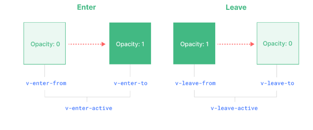

### 关于Vue的内置组件transition
#### 触发条件
+ v-if
+ v-show
+ 由特殊元素 ```<component>``` 切换的动态组件
+ 改变特殊的 key 属性
#### 使用示例
```
<button @click="show = !show">显示or隐藏</button>
<Transition appear> //appear 属性，代表刷新页面就触发动画
  <p v-if="show">hello</p>
</Transition>
```
在不给\<Transition>组件命名时，它生成的过度class将默认以v-作为前缀
```
.v-enter-active,
.v-leave-active {
  transition: opacity 0.5s ease;
}

.v-enter-from,
.v-leave-to {
  opacity: 0;
}
```
给\<Transition> 组件name属性赋值后，生成的calss将以name属性值为前缀
```
<transition name="fade" appear>
        <h1 v-show="flag">一些文字</h1>
</transition>

.fade-enter-active {
   animation: myAnimation .5s; 
   }
 
.fade-leave-active {
   animation: myAnimation .5s reverse;
  }
  @keyframes myAnimation {
    0% {
        transform: scale(0);
        }
    50% {
        transform: scale(1.5);
        }
    100% {
        transform: scale(1);
        }
}

```
>@keyframes规则：
用于创建动画，即逐步改变从一个CSS样式到另一个CSS样式的过程。 指定的变化时发生时使用％，或关键字"from"和"to"（即0%到100%。0％是开头动画，100％是当动画完成。）
animation属性：
animation: name duration timing-function delay iteration-count direction fill-mode play-state;
分别对应：
指定动画名称、持续时间、如何完成一个周期、延迟间隔、播放次数、是否轮流反向播放、动画停止时元素的样式、指定动画是否在运行

#### 示例2
今天在项目中看到有这样的用法：
```
<!-- APP.vue -->
<template>
  <div id="app">
    <div class="pages">
      <transition name="fade" mode="out-in">
        <router-view></router-view>
      </transition>
    </div>
  </div>
</template>

<style lang="less" rel="stylesheet/less">
  #app {
    width: 100%;
    height: 100%;
    overflow: hidden;
  }

  .fade-enter-active,
  .fade-leave-active {
    transition: all 0.2s ease;
  }

  .fade-enter,
  .fade-leave-active {
    opacity: 0;
  }
</style>

```
这里用于组件切换时设置过渡效果。由于组件的进入和离开是同时发生的，而上一个组件的动画完成后，才会让出位置开始下一个组件的进入动画。这会导致视觉上的卡顿效果。上面的`mode="out-in"   `就是为了解决这个问题，具体：
**过渡模式mode**：
**in-out**：新元素先进行过渡，完成之后当前元素过渡离开。
**out-in**：当前元素先进行过渡，完成之后新元素过渡进入。（使用更加频繁）

<br/>
<br/><br/>

附transiton组件渲染周期：
<!--  -->
