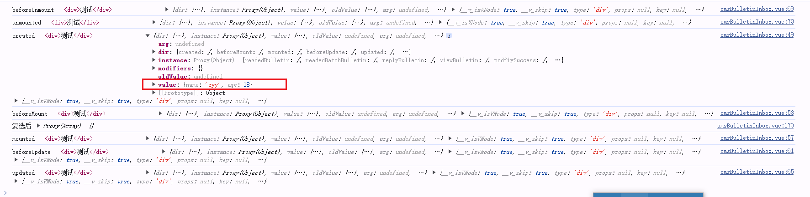
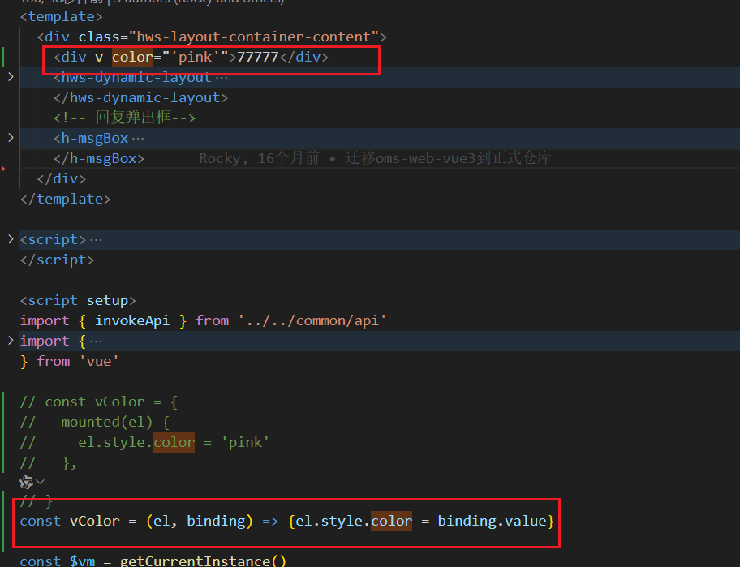
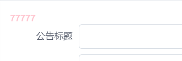

>只有当所需功能只能通过直接的 DOM 操作来实现时，才应该使用自定义指令。其他情况下应该尽可能地使用 v-bind 这样的内置指令来声明式地使用模板，这样更高效，也对服务端渲染更友好。


### Vue2 自定义指令directive   
#### 生命周期  
+ bind：只调用一次，指令第一次绑定到元素时调用。在这里可以进行一次性的初始化设置。
+ inserted：被绑定元素插入父节点时调用 (仅保证父节点存在，但不一定已被插入文档中)。
+ update：所在组件的 VNode 更新时调用，但是可能发生在其子 VNode 更新之前。指令的值可能发生了改变，也可能没有。但是你可以通过比较更新前后的值来忽略不必要的模板更新 (详细的钩子函数参数见下)。
+ componentUpdated：指令所在组件的 VNode 及其子 VNode 全部更新后调用。
+ unbind：只调用一次，指令与元素解绑时调用。
#### 全局指令
```
// 注册一个全局自定义指令 `v-focus`
Vue.directive('focus', {
  // 当被绑定的元素插入到 DOM 中时……
  inserted: function (el) {
    // 聚焦元素
    el.focus()
  }
})
```
#### 局部指令
```
directives: {
  focus: {
    inserted: function (el) {
      el.focus()
    }
  }
}
```

### vue3 自定义指令
#### 生命周期 
```
<div v-MyDirective="{name: 'zyy', age: 18}">测试</div>

const vMyDirective = {
   // 在绑定元素的 attribute 前 或事件监听器应用前调用
  created (el, binding, vnode) {
    console.log('created', el, binding, vnode)
   },
  // 在元素被插入到 DOM 前调用
  beforeMount (el, binding, vnode) {
    console.log('beforeMount',el, binding, vnode)
  },
  // 在绑定元素的父组件 及 他自己的所有子节点都挂载完成后调用
  mounted (el, binding, vnode) {
    console.log('mounted',el, binding, vnode)
  },
  // 绑定元素的父组件更新前调用
  beforeUpdate (el, binding, vnode, prevVnode) {
    console.log('beforeUpdate',el, binding, vnode, prevVnode)
  },
  // 在绑定元素的父组件 及 他自己的所有子节点都更新后调用
  updated (el, binding, vnode, prevVnode) {
    console.log('updated',el, binding, vnode, prevVnode)
  },
  // 绑定元素的父组件卸载前调用
  beforeUnmount (el, binding, vnode) {
    console.log('beforeUnmount',el, binding, vnode)
  },
  // 绑定元素的父组件卸载后调用
  unmounted (el, binding, vnode) {
    console.log('unmounted',el, binding, vnode)
  }
}
```


#### 局部指令
```
export default {
  setup() {
    /*...*/
  },
  directives: {
    // 在模板中启用 v-focus
    focus: {
      /* ... */
    }
  }
}
```
##### 语法糖写法：
定义一个函数，并且这个函数必须用v开头,其中的生命周期和optionsAPI中的定义方法一样的
```
<script setup>
  const vFocus = {
    mounted(el) {
      el?.focus();
    },
  };
</script>

```
#### 全局指令
```
const app = createApp({})

// 使 v-focus 在所有组件中都可用
app.directive('focus', {

})
```

#### 简化形式
适用于仅需要在 mounted 和 updated 上实现相同的行为的指令
```
<div v-color="color"></div>

app.directive('color', (el, binding) => {
  // 这会在 `mounted` 和 `updated` 时都调用
  el.style.color = binding.value
})
```

