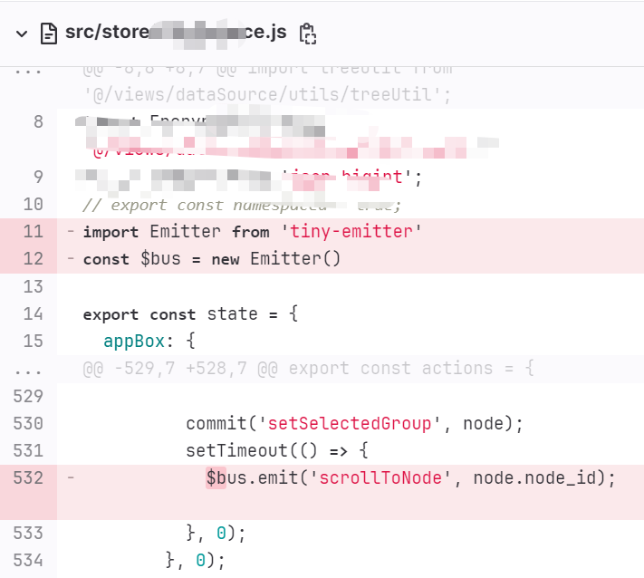

### vue3---事件总线  
众所周知，在 Vue 升级到 3.0 版本后，```prototype```属性就被取消了，所以我们不能再使用 Vue2中 的```Vue.prototype.$bus=new Vue()```的方式来使用全局事件总线。因此呢，我们可以通过第三方库构建事件总线，有很多可以使用的第三方库，比如```tiny-emitter```、```mitt```，这里以```tiny-emitter```为例：   

这里在项目入口页面```index.js```中，构造并挂载全局```$bus```
```
import Emitter from 'tiny-emitter'
app.config.globalProperties.$bus = new Emitter()
```
页面中使用：  
```
import { getCurrentInstance } from 'vue'
const $vm = getCurrentInstance()

$vm.proxy.$bus.emit('testFcuntion', params)
$vm.proxy.$bus.on('testFcuntion', (params) => {...})
$vm.proxy.$bus.off('testFcuntion')
```

#### 为什么事件总线没生效？
一般在vue页面中用上面的用法都没问题，但遇到在js文件中用事件总线的时候，没有this对象，拿不到挂在全局的$bus,于是就像下面这样重新new了一个
  
又在页面中如下监听：
```
$vm.proxy.$bus.on('scrollToNode', () => {
  this.init()
})
```
发现这个```scrollToNode```事件始终没有监听到   
因为是重新```new Emitter()```的事件总线，所以```emit```出```scrollToNode```事件的总线和在```index.js```中挂载到全局的```$bus```不是一条总线，他们并不能够进行通信。  

#### 如何解决像这样的跨服通信呢？   
答案是，**建立一个统一的总线**
新建一个```bus.js```文件： 
```
import Emitter from 'tiny-emitter'
const eventBus = new Emitter()
export default eventBus
```
在使用的时候，不管是 js 页面还是 vue 页面，都通过引入的方式进行使用即可：   
```
import eventBus from '@/common/utils/bus'
eventBus.emit('scrollToNode', node.node_id);
eventBus.on('scrollToNode', (id) => {.....});
```