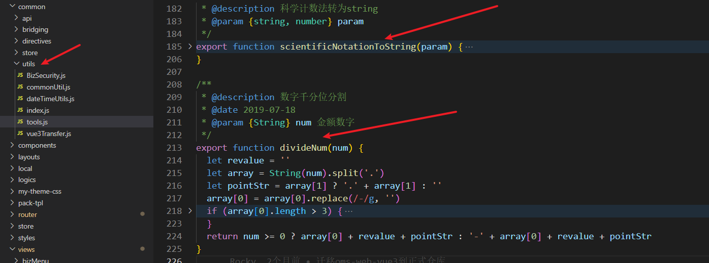

# Vue3 中的hooks
## 前言
### 1. utils
开发中自动抽象出的 纯逻辑函数，不存在属于组件的东西，例如methods中定义的纯函数等
<!--  -->

### 2. mixins
#### 什么是mixins
mixins，即混入，不仅仅在vue框架中存在mixin，确切的说mixin是一种思想，一种混入的思想。混入的内容就是可以在被混入的地方使用，他会自动的将混入的东西准确的分配到指定的组件中。  
在vue中，mixin是一个对象，它将变量、函数、生命周期等封装在内，引用它就可以直接将变量或者函数混入它应该在的地方。
可以认为，vue中的mixin就是相当于组件中的组件。


举个例子：
A、B组件都需要在watch中执行某个方法，utils做的就是实现这个方法，然后导出，A、B组件的watch中再分别引用这个方法  
mixin做的则是直接将方法以及watch全部实现，AB组件直接混入即可，不需要开发人将其放置在指定位置。 

#### mixin的特点
1. 逻辑函数的复用
2. vue 组件配置复用
3. 数据和方法都是独立的，组件之间使用后是互相不影响的

> 组件配置复用是指，组件中的选项式API（例如：data，computed，watch）或者组件的生命周期钩子（created、mounted、destroyed）
#### 使用场景
mixin中除了不能把组件中的template模版抽出来，其他任何options-API都可以抽出来放在mixin中   
mixin中和vue组件中相同的钩子的优先级：

+ mixin中的生命周期函数会和组件的生命周期函数一起合并执行。
+ mixin中的data数据在组件中也可以使用。
+ mixin中的方法在组件内部可以直接调用。
+ 生命周期函数合并后执行顺序：先执行mixin中的，后执行组件的。
+ 组件的同名data 会覆盖 mixins的同名data
+ 组件的同名methods 会覆盖 mixins的同名methods
+ 组件的同名filters 会覆盖 mixins的同名filters

mixins:
```
export const mixins = {
  data() {
    return {
      message: 'I come from mixins'
    }
  },
  computed: {},
  created() {
    console.log('mixins ---- created')
  },
  beforeMount() {
    console.log('mixins ---- beforeMount')
  },
  mounted() {
    console.log('mixins ---- mounted')
  },
  methods: {
    showMessage () {
      console.log(this.message)
    }
  },
}
```
view:
```
<template>
  <div>
    <h-button @click="showMessage">测试</h-button>
  </div>
</template>

<script>

import { mixins } from '../mixins'
export default {
  name: '',
  mixins: [mixins],
  data () {
    return {
      message: 'I come from view'
    }
  },
  created () {
    console.log('view ---- created')
  },
  beforeMount () {
    console.log('view ---- beforeMount')
  },
  mounted () {
    console.log('view ---- mounted')
  },
}
</script>
```

此外，mixin对于不同组件的导入，相互之间数据是不会影响的
#### mixins的不足之处
1. 很容易发生冲突  
因为mixin中的property都被合并到了一个组件中，同名的会被覆盖 （vue中冲突的解决方案是本组件中优先级高于mixin）
2. 定位错误需要花费时间，滥用会造成维护问题   
隐式传入，变量来源不明确，不利于阅读，使代码变得难以维护。
如果引入了多个mixin，那想要知道其中一个具体的属性或者方法来自于哪里，就很难查  
3. 可重用性有限   
只能被动地使用mixin中传递的任何东西，但不能通过传参等方法改变其中的任何逻辑，这导致其灵活性大大降低
## Hooks是什么
hooks相当于mixins的composition Api的写法。   
hooks就是在utils的基础上再包一层组件级别的东西(钩子函数等)。   
> Options API 通过将相关选项分组来组织代码。例如，data 属性包含组件的状态，methods 属性包含组件的方法。这种方式简单直观，容易理解。
而 Composition API 则通过将逻辑组合成可重用的功能来组织代码。这种方式可以让我们更好地重用和测试代码，但也需要一定的学习曲线。

Vue3已经不再推荐使用mixins，因为Composition Api的引入就是为了解决Option Api在代码量大的情况下的强耦合，让开发者有更好的开发体验，因此，为了提高代码的复用性，解决mixin在vue2中的一些缺点，Vue3推荐使用hooks进行组件的封装。
 
例如：我们每次点击button都会弹出一个弹窗，自动显示当前日期。但是我将函数放在util中，每次复用都需要click=handleClick 函数放入日期函数，通过handleClick函数管理utils，那么我不如直接将handleClick也封装起来，下次直接调用，复用了methods注册的环节

hooks和utils的区别：
hooks中如果涉及到ref,reactive,computed这些api的数据，那这些数据是具有响应式的，而utils只是单纯提取公共方法就不具备响应式，因此可以把hook理解为加入vue3 api的共通方法

   
## 如何使用hooks以及Hooks的使用场景
### 使用场景
公共业务逻辑分离
第三方库的二次封装
### 如何使用
1. 将可复用功能抽离为外部js文件
2. 函数名/文件名一般使用use开头，比如： useXXX
3. 引用时将响应变量或者方法显式解构暴露出来，如 const { useCount， count} = useXXX()
例子  
加法hook
```
import { ref, watch } from 'vue';
const useAdd= ({ num1, num2 })  =>{
    const addNum = ref(0)
    watch([num1, num2], ([num1, num2]) => {
        addFn(num1, num2)
    })
    const addFn = (num1, num2) => {
        addNum.value = num1 + num2
    }
    return {
        addNum,
        addFn
    }
}
export default useAdd
```  
减法hook   
```
//减法功能-Hook
import { ref, watch } from 'vue';
export function useSub  ({ num1, num2 }){
    const subNum = ref(0)
    watch([num1, num2], ([num1, num2]) => {
        subFn(num1, num2)
    })
    const subFn = (num1, num2) => {
        subNum.value = num1 - num2
    }
    return {
        subNum,
        subFn
    }
}
```
在组件中使用加减法hooks
```
<template>
    <div>
        num1:<input v-model.number="num1" style="width:100px" />
        <br />
        num2:<input v-model.number="num2" style="width:100px" />
    </div>
    <span>加法等于:{{ addNum }}</span>
    <br />
    <span>减法等于:{{ subNum }}</span>
</template>
​
<script setup>
import { ref } from 'vue'
import useAdd from './useAdd.js'     //引入自动hook 
import { useSub } from './useSub.js' //引入自动hook 
​
const num1 = ref(2)
const num2 = ref(1)
//加法功能-自定义Hook（将响应式变量或者方法形式暴露出来）
const { addNum, addFn } = useAdd({ num1, num2 })
addFn(num1.value, num2.value)
//减法功能-自定义Hook (将响应式变量或者方法形式暴露出来)
const { subNum, subFn } = useSub({ num1, num2 })
subFn(num1.value, num2.value)
</script>
```

## hooks优点
把变量方法按照功能分块写，更符合高内聚低耦合的开发思想
方法属性可追溯来源，更容易维护（因为我们在使用的时候显式的对属性方法进行了结构）
