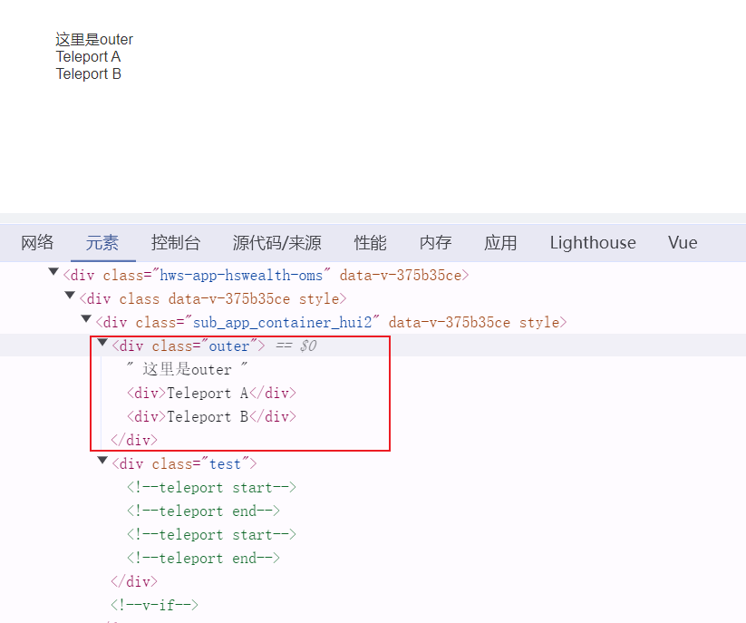
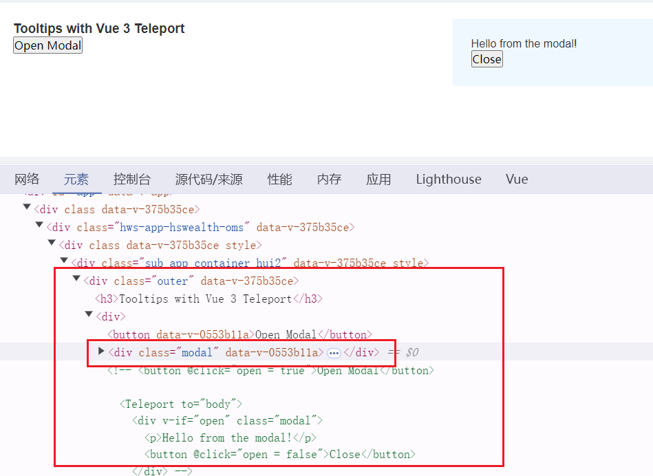
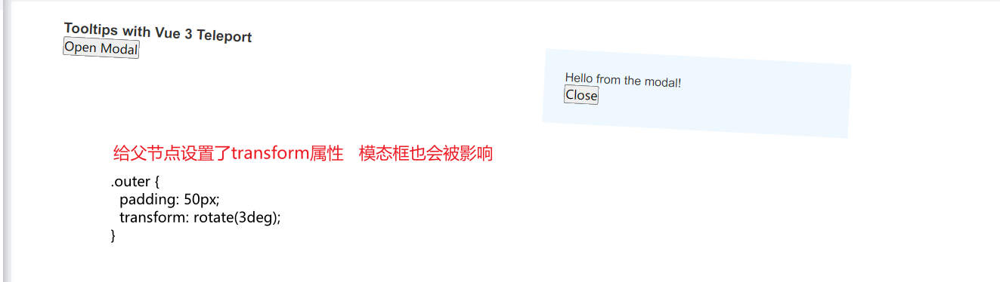
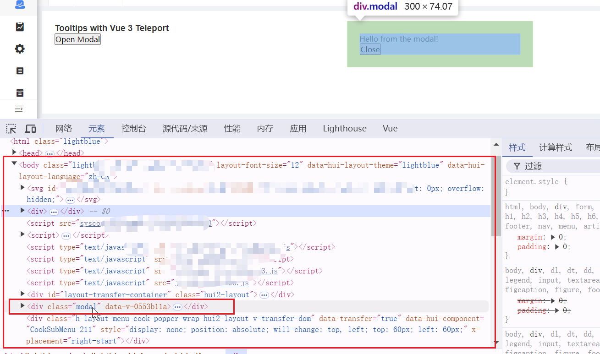
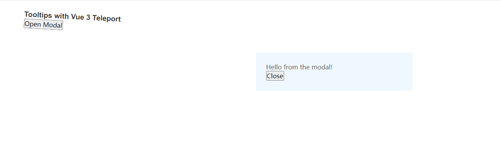
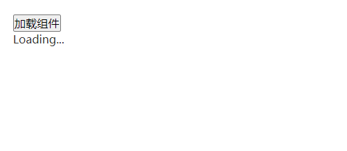
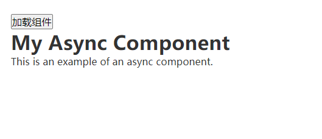

# Vue3内置组件学习
## 1.Teleport
Teleport 可以将指定的内容渲染到特定的容器中，且不受 DOM 层级的限制，这在很多场景下非常有用，比如模态框、通知、弹出菜单或者任何需要脱离当前组件层级结构的元素时非常有用。
例如，element-plus组件库中的 el-dialog组件底层就是使用 Teleport组件实现的
> 模态框是一种常见的UI组件，用于显示一个覆盖在当前页面之上的弹窗，通常用于提示用户信息或要求用户做出选择

#### Teleport 接收两个属性 to 和 disabled。
```
interface TeleportProps {
  /**
   * 必填项；指定目标容器。
   *    - 可以是选择器或实际元素。
   *    - 可以动态更改。
   */
  to: string | HTMLElement
  
  /**
   * 选填项；禁用 Teleport。
   *    - 当值为 `true` 时，内容将保留在其原始位置，而不是移动到目标容器中。
   *    - 可以动态更改。
   */
  disabled?: boolean
}
```
#### demo1: 多个 Teleport 共享目标

```
<template>
  <div class="outer">
    这里是outer
  </div>
  <div class="test">
    <MyModal />
  </div>
</template>

<script setup>
  import MyModal from "./MyModal.vue";
</script>

<style>
.outer {
  padding: 50px;
}
.test{
  background-color: #96c3e1;
}
</style>
```

```
<template>
  <Teleport to=".outer">
    <div>Teleport A</div>
  </Teleport>
  <Teleport to=".outer">
    <div>Teleport B</div>
  </Teleport>
</template>

<script>
export default {
  name: 'MyModal'
}
</script>
```
Teleport A 和 Teleport B 会被渲染到 outer 中，而不是在 test 中。
<!--  -->
[](https://imgse.com/i/pAfEhSf)

#### demo2: 以实现模态对话框为例：
```
<template>
 <div class="outer">
  <h3>Tooltips with Vue 3 Teleport</h3>
  <div>
    <MyModal/>
  </div>
</div>
</template>

<script setup>
import MyModal from "./MyModal.vue";
</script>

<style>
.outer {
  padding: 20px;
}
</style>
```
**不使用teleport实现模态框MyModal：**
``` 
<template>
  <button @click="open = true">Open Modal</button>

  <div v-if="open" class="modal">
    <p>Hello from the modal!</p>
    <button @click="open = false">Close</button>
  </div>

</template>

<script>
export default {
  name: 'MyModal'
}
</script>

<script setup>
import { ref } from 'vue'

const open = ref(false)
</script>

<style scoped>
.modal {
  position: fixed;
  z-index: 999;
  top: 40%;
  left: 50%;
  width: 300px;
  margin-left: -150px;
  background-color: aliceblue;
  padding: 20px;
}
</style>
```
模态框被挂载到了父节点上:
<!--  -->
[](https://imgse.com/i/pAfE4l8)
存在的问题：
1. position: fixed 元素会相对于浏览器窗口进行定位，而不是相对于其祖先元素,如果 position: fixed 元素的任何祖先元素设置了 transform、perspective 或 filter 属性，那么 position: fixed 元素将不再相对于浏览器窗口定位，而是相对于最近的未设置这些属性的祖先元素定位。
   <!--  -->
   [](https://imgse.com/i/pAfEHTs)
2. 这个模态框的 z-index 受限于它的容器元素。如果有其他元素与 ```<div class="outer">``` 重叠并有更高的 z-index，则它会覆盖住我们的模态框。

**使用teleport实现模态框：**
这里通过```to="body"```将模态框挂载到了body上，这样模态框的层级就不受父组件的影响了。
```
<template>
  <button @click="open = true">Open Modal</button>

  <Teleport to="body">
    <div v-if="open" class="modal">
      <p>Hello from the modal!</p>
      <button @click="open = false">Close</button>
    </div>
  </Teleport>
  
</template>

<script>
export default {
  name: 'MyModal'
}
</script>

<script setup>
import { ref } from 'vue'

const open = ref(false)
</script>

<style scoped>
.modal {
  position: fixed;
  z-index: 999;
  top: 40%;
  left: 50%;
  width: 300px;
  margin-left: -150px;
  background-color: aliceblue;
  padding: 20px;
}
</style>
```
挂载到了body上，这样模态框的层级就不受父组件的影响
<!--  -->
[](https://imgse.com/i/pAfELYq)

<!--  -->
[](https://imgse.com/i/pAfEOf0)


#### 注意事项
1. ```<Teleport>``` 挂载时，传送的 to 目标必须已经存在于 DOM 中。理想情况下，这应该是整个 Vue 应用 DOM 树外部的一个元素。如果目标元素也是由 Vue 渲染的，你需要确保在挂载 ```<Teleport>``` 之前先挂载该元素。当 Teleport 的目标元素不存在时，子元素将不会被渲染
2. Teleport 不能用于根组件，因为根组件是 Vue 应用的入口点，它必须渲染到一个具体的 DOM 节点上。通常，根组件会挂载到一个指定的 DOM 元素上，例如 ```<div id="app"></div>```。
3. Teleport 的子元素不会影响其周围的兄弟元素，因此可以用于创建浮动或覆盖元素，而不干扰页面的布局流。


## 2. Suspense
Suspense 用来在组件树中协调对异步依赖的处理。它让我们可以在组件树上层等待下层的多个嵌套异步依赖项解析完成，并可以在等待时渲染一个加载状态.
:apple:```<Suspense>``` 是一项实验性功能。它不一定会最终成为稳定功能，并且在稳定之前相关 API 也可能会发生变化。所以这里简略了解下.
>异步组件默认就是“suspensible”的。这意味着如果组件关系链上有一个 ```<Suspense>```，那么这个异步组件就会被当作这个 ```<Suspense>``` 的一个异步依赖。在这种情况下，加载状态是由 ```<Suspense>``` 控制，而该组件自己的加载、报错、延时和超时等选项都将被忽略。
异步组件也可以通过在选项中指定 ```suspensible: false``` 表明不用 Suspense 控制，并让组件始终自己控制其加载状态。


#### 关于异步组件 ```defineAsyncComponent```

```
function defineAsyncComponent(
  source: AsyncComponentLoader | AsyncComponentOptions
): Component

type AsyncComponentLoader = () => Promise<Component>

interface AsyncComponentOptions {
  loader: AsyncComponentLoader  // 需要异步加载的组件
  loadingComponent?: Component  // 异步组件加载过程中 使用的组件
  errorComponent?: Component  // 加载失败后展示的组件
  delay?: number  //加载异步组件的延迟时间,默认为 200ms
  timeout?: number  // 异步组件加载超时时间
  suspensible?: boolean
  onError?: (
    error: Error,
    retry: () => void,
    fail: () => void,
    attempts: number
  ) => any
}
```

#### 用法
```<Suspense>``` 组件有两个插槽：
两个插槽都只允许一个直接子节点。在可能的时候都将显示默认槽中的节点。否则将显示后备槽中的节点。
1. ```#default``` 放需要加载的组件
2. ```#fallback``` 组件加载期间想要显示的内容

#### demo1 :
```
<template>
  <div class="home">
    <button @click="show = !show">加载组件</button>

    <Suspense v-if="show">
      <template #default>
        <MyAsyncComponent />
      </template>
      <template #fallback>
        <div>Loading...</div>
      </template>
    </Suspense>

  </div>
</template>

<script setup>
import { ref, defineAsyncComponent } from 'vue';
// 异步组件 实际渲染的时候才会去加载对应的资源
// let MyAsyncComponent = defineAsyncComponent(() => import('./MyAsyncComponent.vue'))
let show = ref(false)
let MyAsyncComponent = defineAsyncComponent({
  loader: () => {
    return new Promise((resolve, reject) => {
      setTimeout(() => {
        resolve( import('./MyAsyncComponent.vue'))
      }, 2000);
    })
  },
  delay: 2000
})
</script>

<style>
.home {
  padding: 20px;
}
</style>
```

```
<template>
  <div>
    <h1>My Async Component</h1>
    <p>This is an example of an async component.</p>
  </div>
</template>

<script>
export default {
  name: 'MyAsyncComponent'
}
</script>
```
<!-- 
 -->
[](https://imgse.com/i/pAfEvlT)
[](https://imgse.com/i/pAfEjpV)