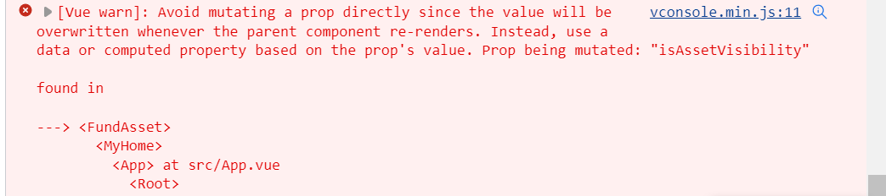

### 子组件修改父组件数据
> 前情提要
> 需求描述：
> 页面每次进入时，刷新子组件的assetVisibility状态（用于控制子组件中某个数据是否显示）

##### 最初的实现
父组件中写了init()方法，在每次页面进入时都会执行，所以我将assetVisibility定义在父组件中，在init()中加this.assetVisibility=true,并通过props把assetVisibility传给子组件。具体如下：
```
父组件index.vue
<template>
  <div>
    ......
      <FundAsset
        ref="fundAsset"
        :assetVisibility="assetVisibility"
      ></FundAsset>
    .....
  </div>
</template>

<script>
export default {
  name: 'myHome',
  components: {
  },
  data() {
    return {
      assetVisibility: true
    };
  },
  created() {
    this.init();
  },
  methods: {
    init() {
        .....
        this.assetVisibility = true;    
        .....     
        }
    }
</script>
```

```
子组件FundAsset.vue
<template>
  <div class="my-account">
    <div class="login-top">
        总资产(元)
        <svg-icon
          class="browse"
          :name="assetVisibility ? 'browse' : 'browse-off'"
          @click="handleChangeAssetVisibility"
        ></svg-icon>
    </div>
    <div class="asset-amount">
        {{ assetVisibility ? assetObj.allAsset : '****' }}
    </div>
  </div>
</template>

<script>
export default {
  props: {
    assetVisibility: {
      type: Boolean,
      default () {
        return true;
      }
    }
  },
  methods: {
    // 修改资产可视状态
    handleChangeAssetVisibility () {
      this.assetVisibility = !this.assetVisibility;
    },
  }
};
</script>
```
这样会产生如下报错：

意思是不能直接在子组件中修改父组件的属性值，因为每当父组件重新渲染就会覆盖子组件的修改。那么如何能够在子组件中修改父组件的值呢？

##### 方法一
借助中间变量，避免直接修改props

```
子组件FundAsset.vue
<template>
  <div class="my-account">
    <div class="login-top">
        总资产(元)
        <svg-icon
          class="browse"
          :name="assetVisibility ? 'browse' : 'browse-off'"
          @click="handleChangeAssetVisibility"
        ></svg-icon>
    </div>
    <div class="asset-amount">
        {{ assetVisibility ? assetObj.allAsset : '****' }}
    </div>
  </div>
</template>

<script>
export default {
  props: {
    assetVisibility: {
      type: Boolean,
      default () {
        return true;
      }
    }
  },
  data () {
    return {
      isAssetVisibility: this.assetVisibility
    }
  },
  methods: {
    // 修改资产可视状态
    handleChangeAssetVisibility () {
      this.isAssetVisibility = !this.isAssetVisibility;
    },
  }
};
</script>
```
这样虽然解决了上面的报错，但父组件重新渲染后。子组件并不能够重新刷新数据，因此添加watch。监听assetVisibility的变化，及时更新子组件的数据。
```
子组件FundAsset.vue
<template>
  <div class="my-account">
    <div class="login-top">
        总资产(元)
        <svg-icon
          class="browse"
          :name="isAssetVisibility ? 'browse' : 'browse-off'"
          @click="handleChangeAssetVisibility"
        ></svg-icon>
    </div>
    <div class="asset-amount">
        {{ isAssetVisibility ? assetObj.allAsset : '****' }}
    </div>
  </div>
</template>

<script>
export default {
  props: {
    assetVisibility: {
      type: Boolean,
      default () {
        return true;
      }
    }
  },
  data () {
    return {
      isAssetVisibility: this.assetVisibility
    }
  },
  watch: {
    assetVisibility: {
      handler(val) {
        console.log('watch assetVisibility', val);
        this.isAssetVisibility = val;
      }
    }
  },
  methods: {
    // 修改资产可视状态
    handleChangeAssetVisibility () {
      this.isAssetVisibility = !this.isAssetVisibility;
    },
  }
};
</script>
```
然后，新的问题就出现了，子组件监听不到父组件的数据改变。
.......
因为父组件的值一直为true，并没有改变过。。。。子组件修改了isAssetVisibility之后，没有emit到父组件！！！在改变可视状态的方法里加一行**this.$emit('setAssetVisibility', this.isAssetVisibility);**
然后父组件接受到子组件的改变，就完美解决！
```
子组件FundAsset.vue
<template>
  <div class="my-account">
    <div class="login-top">
        总资产(元)
        <svg-icon
          class="browse"
          :name="isAssetVisibility ? 'browse' : 'browse-off'"
          @click="handleChangeAssetVisibility"
        ></svg-icon>
    </div>
    <div class="asset-amount">
        {{ isAssetVisibility ? assetObj.allAsset : '****' }}
    </div>
  </div>
</template>

<script>
export default {
  props: {
    assetVisibility: {
      type: Boolean,
      default () {
        return true;
      }
    }
  },
  data () {
    return {
      isAssetVisibility: this.assetVisibility
    }
  },
  watch: {
    assetVisibility: {
      handler(val) {
        console.log('watch assetVisibility', val);
        this.isAssetVisibility = val;
      }
    }
  },
  methods: {
    // 修改资产可视状态
    handleChangeAssetVisibility () {
      this.isAssetVisibility = !this.isAssetVisibility;
      this.$emit('setAssetVisibility', this.isAssetVisibility);
    },
  }
};
</script>
```

```
父组件index.vue
<template>
  <div>
    ......
      <FundAsset
        ref="fundAsset"
        :assetVisibility="assetVisibility"
        @setAssetVisibility="setAssetVisibility"
      ></FundAsset>
    .....
  </div>
</template>

<script>
export default {
  name: 'myHome',
  components: {
  },
  data() {
    return {
      assetVisibility: true
    };
  },
  created() {
    this.init();
  },
  methods: {
    init() {
        .....
        this.assetVisibility = true;    
        .....     
        },

    setAssetVisibility(val) {
        this.assetVisibility = val;
        },
    }
</script>
```

##### 方法二
更为简单的一种方式是，直接将 assetVisibility 定义在子组件中，每次刷新 assetVisibility = true 的方法也定义在子组件中， 父组件只需要在init() 中调用子组件的此方法即可。
```
父组件index.vue
<template>
  <div>
    ......
      <FundAsset
        ref="fundAsset"
      ></FundAsset>
    .....
  </div>
</template>

<script>
export default {
  name: 'myHome',
  components: {
  },
  data() {
    return {
      assetVisibility: true
    };
  },
  created() {
    this.init();
  },
  methods: {
    init() {
        .....
        this.$refs.fundAsset.resetAssetVisibility();
        .....     
        },
    }
</script>
```

```
子组件FundAsset.vue
<template>
  <div class="my-account">
    <div class="login-top">
        总资产(元)
        <svg-icon
          class="browse"
          :name="isAssetVisibility ? 'browse' : 'browse-off'"
          @click="handleChangeAssetVisibility"
        ></svg-icon>
    </div>
    <div class="asset-amount">
        {{ isAssetVisibility ? assetObj.allAsset : '****' }}
    </div>
  </div>
</template>

<script>
export default {
  data () {
    return {
      isAssetVisibility: true
    }
  },
  methods: {
    // 修改资产可视状态
    handleChangeAssetVisibility () {
      this.isAssetVisibility = !this.isAssetVisibility;
    },
    // 重置资产可视状态
    resetAssetVisibility() {
       this.isAssetVisibility = true;
    },
  }
};
</script>
```