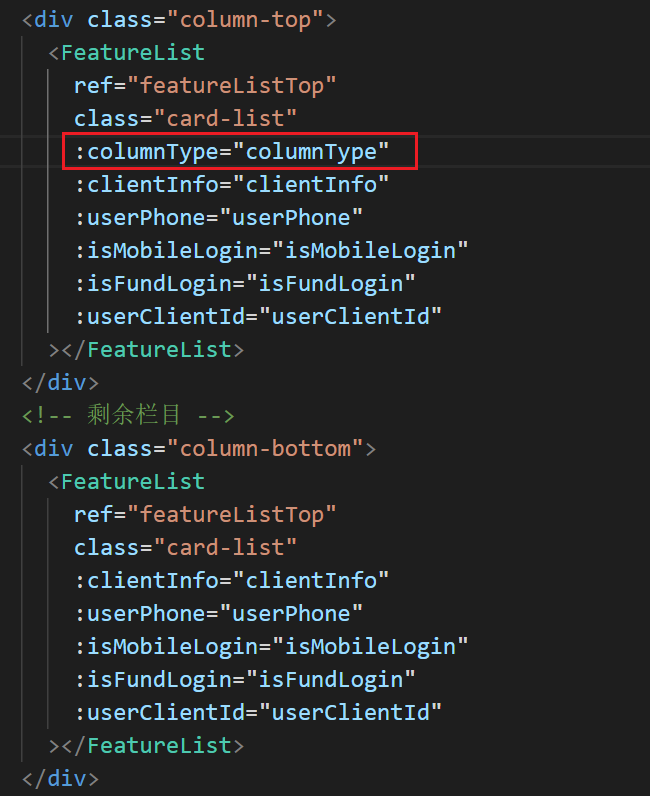
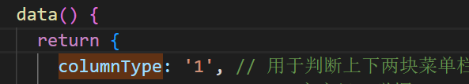
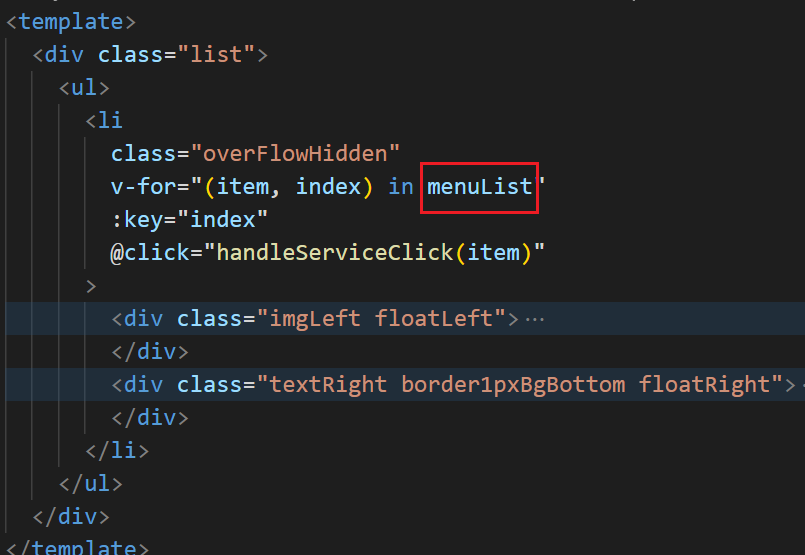
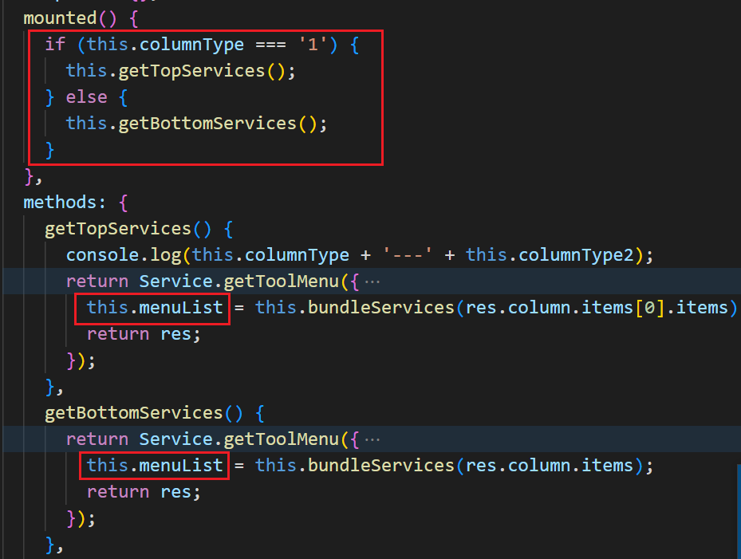

#### 关于组件复用
以往组件复用的时候，我都会把结构写在子组件中，具体的数据渲染放到都组件中。所以思想固化后，遇到一个父组件中要复用同一个子组件两次时，也是想把数据渲染都放到父组件中。但这样会使父组件的代码量变多，不易维护。所以想到把具体的请求和数据渲染改到子组件中，父组件中直接拿过来用。
具体的方案是给组件绑定一个请求类型的属性，在子组件中根据有无这个属性决定赋值的数据来自于哪一个接口。具体如下：
###### 父组件

###### 子组件

