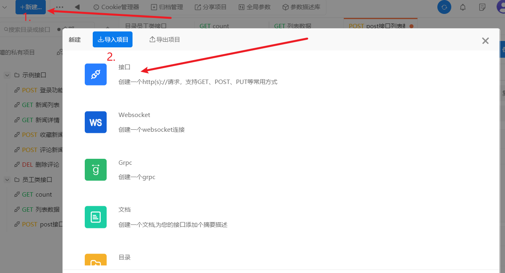
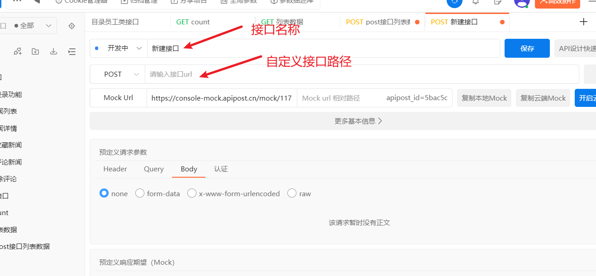
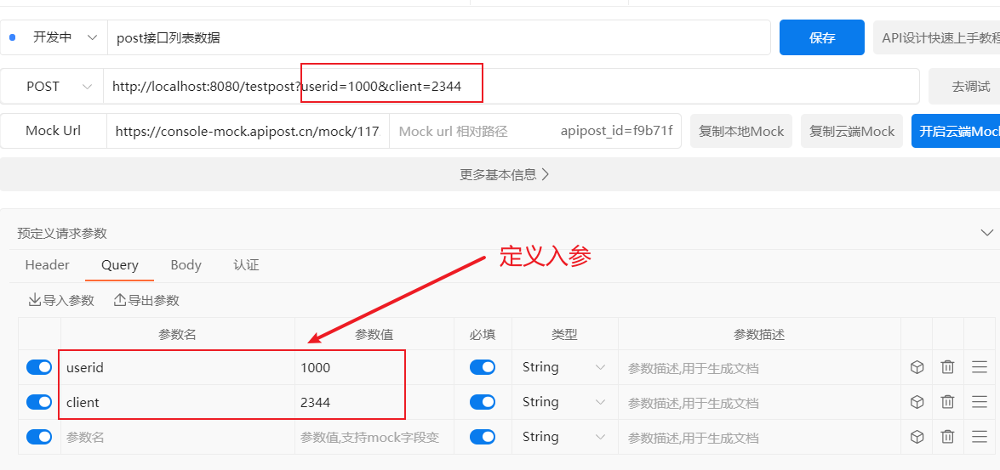
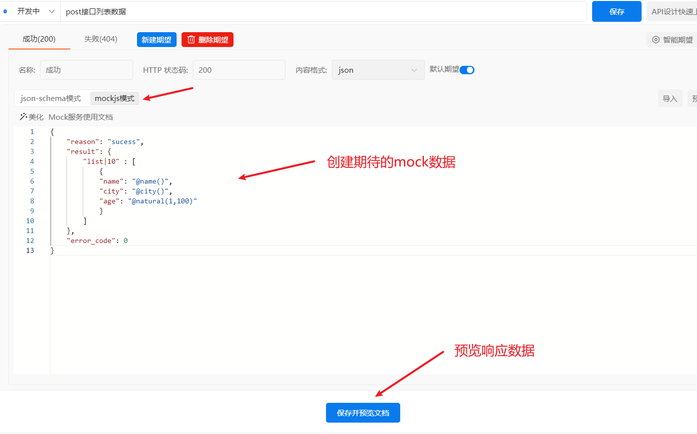
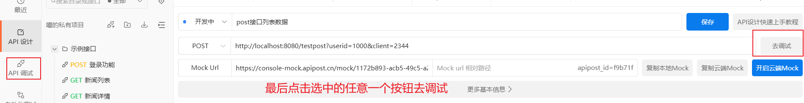

## mock基本语法 与 Apipost 的基本使用
### mock 基本语法
#### 语法规范
```
"name|rule": value
```
+ name：属性名
+ rule: 规则，常用于限制数据数量、范围等
   一共有七种 rule 格式：
   1. ```"name|min-max": value```
   2. ```"name|count": value```
   3. ```"name|min-max.dmax-dmin": value``` min-max 是整数部分的范围 dmax-dmin是小数部分的范围
   4. ```"name|min-max.count": value``` count为小数部分保留的位数
   5. ```"name|count.dmin-dmax": value``` dmin-dmax 为小数部分保留的位数范围
   6. ```"name|count.dcount": value``` dcount 为小数部分保留的位数
   7. ```"name|+step": value```  顺序选取step个元素
+ value：属性值，可以是占位符、初始值，也可以是类型  

#### 常见用法
:dash: [参考1](https://blog.csdn.net/agai25/article/details/115707461)
:dash: [参考2](https://blog.csdn.net/qq_37568942/article/details/111193826)

### Apipost 的基本使用




