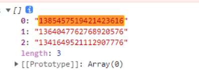

## 为何遍历请求，拿到的数据可以打印但实际为空
前言：在开发中需要遍历数组，依次发送请求，将请求回来的所有结果push到结果数组中，把结果数组return出去，在另一个方法拿到这个结果数组，处理并最终遍历渲染结果数组中的数据。
```
getAllDataList() {
  let renderDataList = []
  this.groupReportList.forEach((item) => {
    let params = {
      report_code: item.report_code,
      ......
    }
    invokeApi(this.gsv, `getRptReportDataQuery`, params).then((res) => {
      if (.....) {
        let response = resolveJson(res)
        ......
        renderDataList.push(response)
      } else {
        ......
      }
    })
  })
  return renderDataList
}

updateDataList() {
  let res = getAllDataList()
  console.log(res)
}

```
问题：res 值始终为空，打印结果类似下面：


原因：这里的 invokeApi 为异步请求， getAllDataList 将 结果数组 return 出去的时候，请求可能还没有结束，导致 return 出去的是空数组，等异步请求全部结束，数组才有值，所以打印的结果就会看到实际无值，但展开可以看到值得样子。  

解决方案： 利用 async  await 
```
 async getRenderData(reportItem) {
      let groupReportList1 = []
      let inputQueryParams = {
        ...this.inputDefaultParams,
        ...this.inputQueryParams,
      }
      inputQueryParams = filterEmptyObject(inputQueryParams)

      let groupReportListForRender = []
      if(reportItem) {
        // 排序 更新当前表格
        groupReportListForRender = [reportItem]
      } else {
        groupReportListForRender = this.groupReportList
        this.sortParams = []
      }

      for (let item of groupReportListForRender) {
        let params = {
          report_code: item.report_code || item.reportCode,
          ...
        }
        let res = await invokeApi(this.gsv, `getRptReportDataQuery`, params)
        if (
          !res[window.LOCAL_CONFIG.RESPONSE_DATA.code] ||
          res[window.LOCAL_CONFIG.RESPONSE_DATA.code] === '0'
        ) {
          let response = resolveJson(res)
          let renderData = {}
          covertObj(response, renderData, false, false)

          const obj = {
            reportCode: item.report_code,
            renderData: renderData,
          }
          groupReportList1.push(obj)
        } else {
          this.$hMessage.error(res[window.LOCAL_CONFIG.RESPONSE_DATA.errorData])
        }
      }
      return groupReportList1
    },
    async updateRenderData(reportItem) {
      try {
        // reportItem 为点击排序的报表
        if(reportItem) {
          this.$set(this.loading,reportItem.reportCode,true)
        } else {
          this.groupReportList.forEach(item => {
            this.$set(this.loading,item.report_code,true)
          })
        }
        const res = await this.getRenderData(reportItem)

        if(reportItem) {
          this.renderDataList.forEach((item) => {
              if (item.reportCode === reportItem.reportCode) {
                item.renderData = res[0].renderData
              }
            })
        } else {
          this.renderDataList = mergeArraysByKey(res, this.reportInfoList, 'reportCode')
        }
      } finally {
        if(reportItem) {
          this.$set(this.loading,reportItem.reportCode,false)
        } else {
          this.renderDataList.forEach((item) => {
            this.$set(this.loading,item.reportCode,false)
          })
        }
      }
    },
```


> 根据关联键合并对象数组
```
/**
 * 根据关联键合并对象数组
 * @param arr1 数组1
 * @param arr2 数组2
 * @param key 依赖key
 * @returns {*[]} 合并的新对象数组
 */
 export function mergeArraysByKey(arr1,arr2,key){
  const result = []
  arr1.forEach((arr1_item)=>{
      arr2.forEach((arr2_item)=>{
          if (arr2_item[key] === arr1_item[key]){
              result.push(Object.assign(arr2_item,arr1_item))
          }
      })
  })
  return result
}
```

