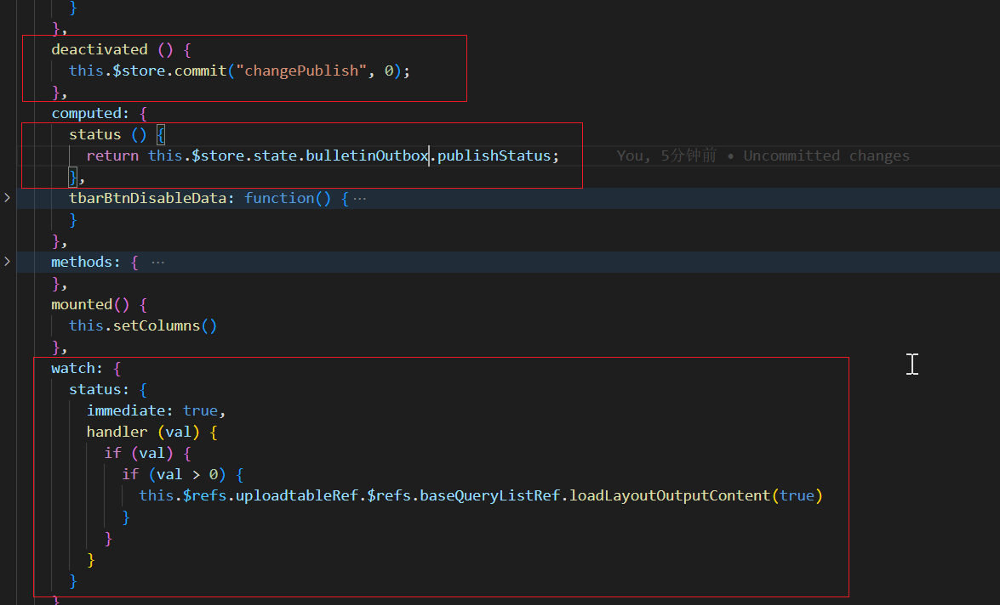
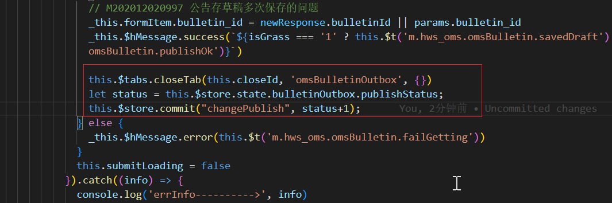

#### 业务场景：
列表页面 ---> 点击编辑 ---> 进入编辑页面 ---> 提交编辑 ---> 关闭编辑页面，回到列表页面 ---> 刷新列表状态
> 刷新机制：activated钩子中，监听关闭编辑页面时传递的路由参数，进行刷新
```
activated() {
  if (this.$route.query.reload === '1') {
    this.$refs.uploadtableRef.$refs.baseQueryListRef.loadLayoutOutputContent(true)
    }
}
```

#### 现有问题：
列表页面 ---> 点击编辑A页面 ---> 点击编辑B页面 ---> 提交A（A耗时久，一直在提交中） ----> 提交B页面(B耗时少，提交成功) ---> B页面提交完成，自动关闭，回到列表页面，刷新列表  ---> A页面提交成功，关闭A页签，由于已经在列表页，不再刷新列表状态。

#### 解决方案
列表页与编辑页不存在父子关系，一般非父子组件调用另一组件的方法有三种：
**1. 引用该组件，通过 XXX.methods.XXX调用**

列表页editView.vue:   
```
methods: {
  refreshTable() {
    this.$refs.uploadtableRef.$refs.baseQueryListRef.loadLayoutOutputContent(true)
  }
}
```
修改页
```
import editView from '...'
editView.methods.refreshTable()
```
这里刷新方法用的ref调用的，存在调用时还未加载的情况，不适用。
**2. 使用vuex**
> sotre中存一个变量，初始值0，每次编辑关闭＋1，在列表页监听这个变量，大于0就刷新。每次deactivated就清空改变量。  

Store
```
export default  {
  state: {
    publishStatus: 0
  },
  mutations: {
    changePublish (state,publish) {
      state.publishStatus = publish
    }
  }
}

```
列表页：  
   
编辑页：  


**3. 事件总线**
