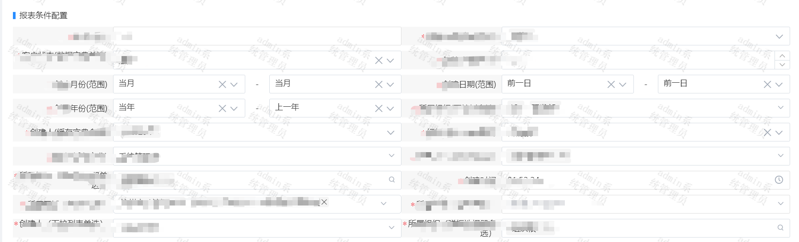
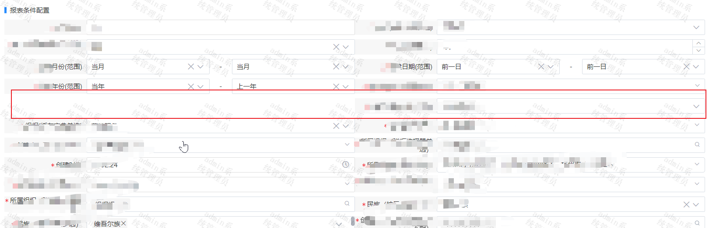
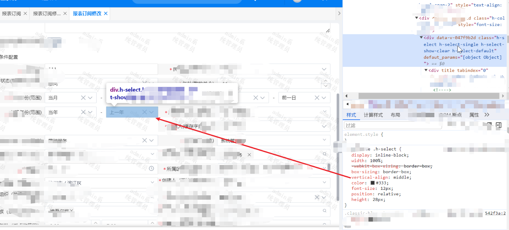
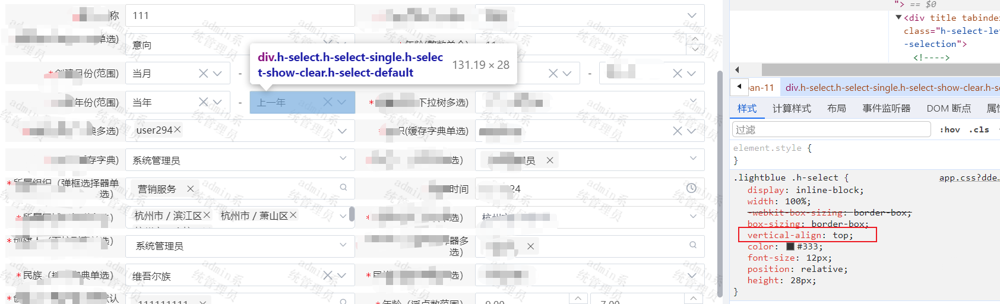
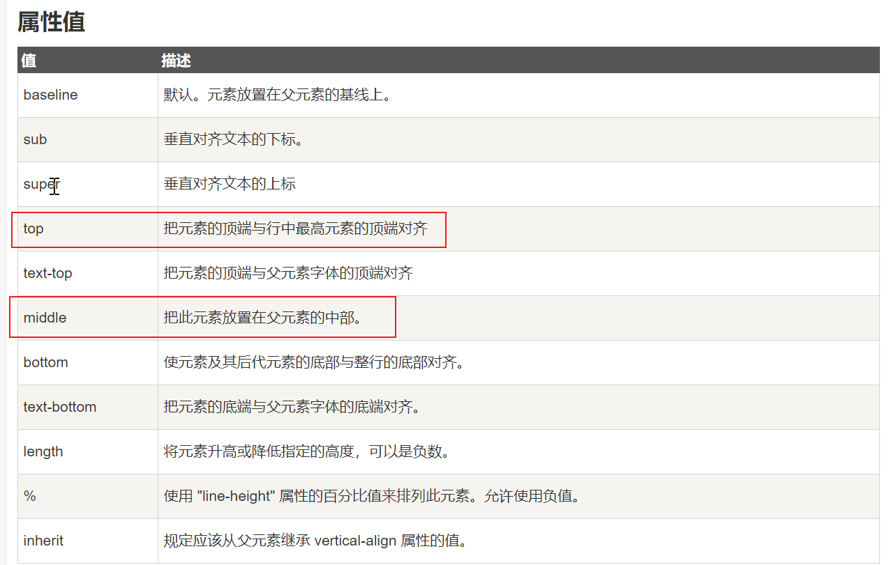

### 问题
form表单在125%分辨率下样式错乱，其余分辨率下都正常排列。
其余分辨率：  
   
125%分辨率


### 解决方法
刚开始看到这个问题的时候，没什么头绪，尝试避免设出现125%分辨率这种情况。 如下：   
```
/**
 * @author trsoliu
 * @date  2019-12-05
 * @description 校正windows页面在系统进行缩放后导致页面被放大的问题，通常放大比例是125%、150%
 * **/

 class DevicePixelRatio {
	constructor() {
		
	}
	//获取系统类型
	_getSystem() {
		var agent = navigator.userAgent.toLowerCase();
		//现只针对windows处理，其它系统暂无该情况，如有，继续在此添加
		if(agent.indexOf("windows") >= 0) {
			return true;
		}
	}

	//监听方法兼容写法
	_addHandler(element, type, handler) {
		if(element.addEventListener) {
			element.addEventListener(type, handler, false);
		} else if(element.attachEvent) {
			element.attachEvent("on" + type, handler);
		} else {
			element["on" + type] = handler;
		}
	}
	//校正浏览器缩放比例
	_correct() {
		//页面devicePixelRatio（设备像素比例）变化后，计算页面body标签zoom修改其大小，来抵消devicePixelRatio带来的变化。
		if (window.devicePixelRatio === 1.25) {
			document.getElementsByClassName('testClass')[0].style.zoom = 1.5 / window.devicePixelRatio
		}
		// document.getElementsByTagName('body')[0].style.zoom = 1/ window.devicePixelRatio;
	}
	//监听页面缩放
	_watch() {
		let t = this;
		t._addHandler(window, 'resize', function() { //注意这个方法是解决全局有两个window.resize
			//重新校正
			t._correct()
		})
	}
	//初始化页面比例
	init() {
		let t = this;
		if(t._getSystem()) { //判断设备，目前只在windows系统下校正浏览器缩放比例
			//初始化页面校正浏览器缩放比例
			t._correct();
			//开启监听页面缩放
			t._watch();
		}
	}
}
export default DevicePixelRatio;
```
引入，并在出现样式错乱的页面调用
```
import DevicePixelRatio from '../../common/utils/devicePixelRatio';
mounted() {
  new DevicePixelRatio().init()
},
```

这样虽然能解决布局错误问题，但是该页面无法实现125%分辨率，所以这个小怪招不可取。   

然后再尝试删掉布局错乱周围的标签后，发现是hSelect这个组件导致的样式错乱！  
于是将 ``` vertical-align:middle;```修改为``` vertical-align:top;```后， 一切回到了正轨。。。。。。


   

### 公主请记住
> 以下来自菜鸟教程
> vertical-align :设置一个元素的垂直对齐方式。
> 该属性定义行内元素的基线相对于该元素所在行的基线的垂直对齐。允许指定负长度值和百分比值。这会使元素降低而不是升高。在表单元格中，这个属性会设置单元格框中的单元格内容的对齐方式。  
