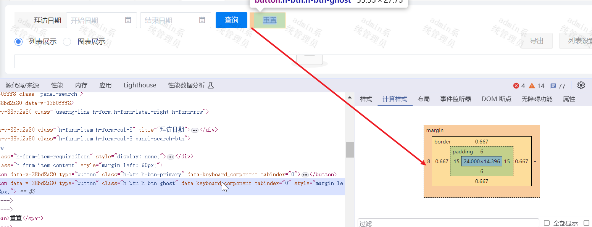

### 问题描述
两button之间明明只有8px的margin，但多出了一个间距。


### 原因
按钮（button）之间的间隔不是由按钮本身的属性决定的，而是由于HTML中的空白字符（如空格、换行或制表符）导致的。浏览器渲染会把这些空白字符作为正常的文本间隔，所以导致两按钮之间会多一块间距。

### 解决方案
1. 给两按钮的父元素加上```font-size: 0```
   ```
    <div style="font-size:0">
          <h-button type="primary" @click="submitQuery">查询</h-button>
          <h-button type="ghost" @click="reset" style="margin-left: 8px;">重置</h-button>
    </div>
   ```
2. 减少或消除HTML中的空白字符：将按钮写在同一行，或者使用HTML注释符号```<!-- -->```来消除空格
   ```
    <div style="font-size:0">
          <h-button type="primary" @click="submitQuery">查询</h-button><h-button type="ghost" @click="reset" style="margin-left: 8px;">重置</h-button>
    </div>
   ```