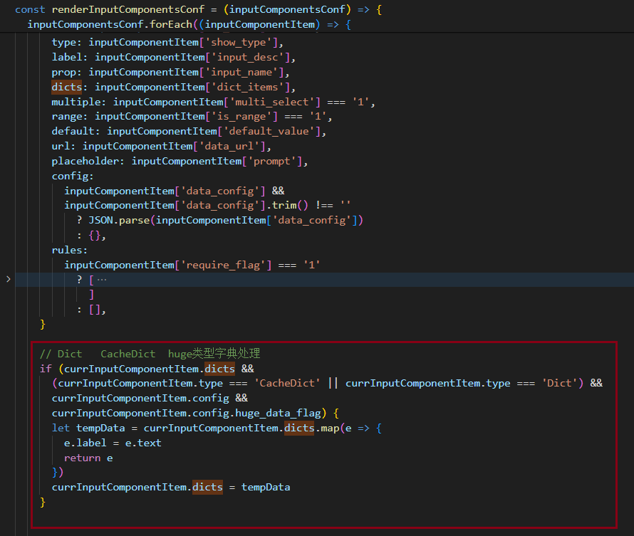

### vue3 死循环导致页面崩溃问题
```[Vue warn]: Maximum recursive updates exceeded in component <SimpleSelect>. ```    

##### 场景：循环渲染组件，接口返回的数据需要处理为组件需要的格式

```
  <template v-for="(componentItem, index) in visibleInputComponentsFilter">
    <template v-else-if="componentItem.type === 'InterfaceDict'">
      <h-form-item
        :prop="componentItem.prop"
        :label="componentItem.label"
        :key="componentItem.prop"
      >
        <h-simple-select
          v-if="componentItem.config.huge_data_flag"
          v-model="inputQueryForm[componentItem.prop]"
          .....
        >
        <h-select-block
            :data="getSimpleSelectData(componentItem.dicts)"
          ></h-select-block>
        </h-simple-select>
      </h-form-item>
    </template>
  </template>
  <script>
    ......
    // 格式化大数据下拉列表
    const getSimpleSelectData = (data) => {
      if (!data || !Object.keys(data).length) {
        console.log('SimpleSelectData数据为空!', data)
        return data
      }
      return data.map(e => {
        e.label = e.text
        return e
      })
    }
    ......
  </script>
```

##### 报错原因
这个错误是Vue.js框架抛出的，意味着在组件```<SimpleSelect>```中发生了**递归更新**，也就是数据变化导致了组件的再次渲染，而新的渲染又因为一个数据的变化而再次发生，形成了无限循环，最终超出了Vue的最大递归更新次数限制。

##### 解决方法：
1. 检查<SimpleSelect>组件中的数据依赖，确保没有循环依赖。
2. 确保在数据变化时，只更新必要的数据，避免不必要的数据更新导致的循环。
3. 如果组件中包含子组件，确保子组件的数据更新不会影响父组件的数据，或者父组件的数据更新不会影响子组件的数据。
4. 使用Vue的v-once指令或者Object.freeze()来避免不必要的数据响应式更新。
5. 如果确实需要递归更新，可以考虑使用Vue的$nextTick方法，在DOM更新完成后再进行下一次更新，以此来控制递归的深度

这里是因为 ```getSimpleSelectData```导致了递归更新
修改为拿到数据时即处理即可：
<!--  -->


