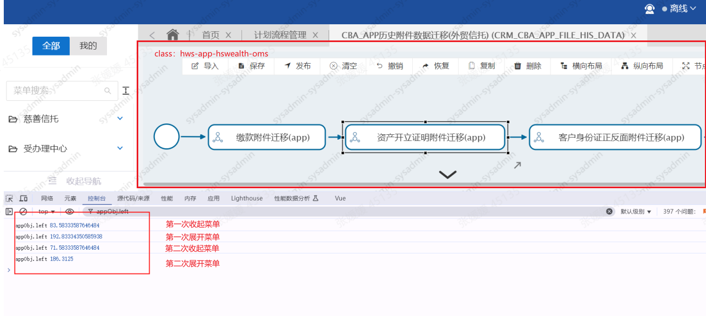
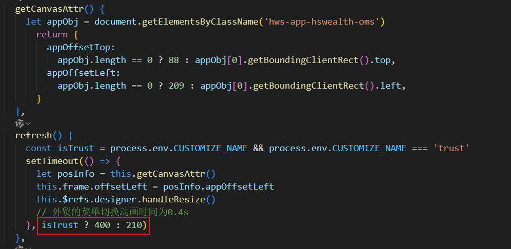

#### 问题描述
画布中绘制的流程图 点击和拖拽 触发的位置不对了，点击节点无法触发该节点的相关事件。
#### 原因分析
触发的位置不对，说明计算鼠标是否在节点dom内的判断出现了问题，一番排查后发现，在客户框架下缺少了计算画布宽高的class，导致```MutationObserver```监听失效。修改后，在首次进入画布后可以正常点击，但改变侧边菜单伸缩状态后，计算的位置再次出现问题。

因此排查侧边DOM监听后发现，getBoundingClientRect计算的宽度每次都有误差，导致计算位置出现偏差。  
**可能造成getBoundingClientRect计算不准确的原因有以下几种**：

1. **元素内容溢出**
   如果元素的内容超出了其指定的宽度，‌getBoundingClientRect可能无法正确计算元素的实际宽度。‌这种情况下，‌可以考虑使用CSS属性overflow: hidden来隐藏溢出的内容，‌或者使用其他方法来计算元素的宽度。‌
2. **边框和内边距**
   getBoundingClientRect返回的是元素的边界框，‌包括边框和内边距。‌如果元素设置了边框或内边距，‌这些值会影响计算的准确性。‌可以通过减去边框和内边距的值来得到实际内容的宽度。‌
3. **浮动或定位元素**
   如果元素包含了浮动元素或定位元素，‌它们可能会影响到getBoundingClientRect的计算结果。‌在这种情况下，‌可以考虑使用其他方法来计算元素的宽度，‌例如使用offsetWidth属性。
4. **CSS动画执行状态**
   如果该dom设置了CSS动画，那么在动画执行结束前计算的值可能会存在误差，‌监听动画执行完成后再次执行getBoundingClientRect才能获取到正确的值。‌

#### 解决方案
根据以上，定位到客户框架下计算不准确是由于侧边菜单动画未结束就计算了画布的宽高导致的，因此增加定时器，保证在动画效果结束后，再计算。



兼容不同框架后的正确代码：
```
<script>
let lastSideBarEl = null
export default {
  name: 'processDesignEntry',
  components: {
    processDesigner: processDesigner,
  },
  data: function () {
    let posInfo = this.getCanvasAttr()
    return {
      frame: {
        offsetTop: posInfo.appOffsetTop,
        offsetLeft: posInfo.appOffsetLeft,
        paddingLeft: 10,
        paddingTop: 8,
      },
      observer: null,
    }
  },
  mounted() {
    // 记录首次渲染时的dom： lastSideBarEl
    const isTrust = process.env.CUSTOMIZE_NAME && process.env.CUSTOMIZE_NAME === 'trust'
    if (isTrust) {
      // 该框架下通过监听侧边栏的style，判断是否是收起状态
      lastSideBarEl = document.getElementsByClassName('left-menu-com')[0].getAttribute('style')
    } else {
      // 该框架下通过监听侧边栏的class，判断是否是收起状态（防止IE不兼容classList，此处用className做判断）
      const targetClass = isMicroApp() ? 'h-layout-sidebar' : 'h-sidebar-wrapper'
      lastSideBarEl = document.getElementsByClassName(targetClass)[0]?.className
    }
    this.init()
  },
  methods: {
    getCanvasAttr() {
      let appObj = document.getElementsByClassName('hws-app-hswealth-oms')
        return {
          appOffsetTop:
            appObj.length == 0 ? 88 : appObj[0].getBoundingClientRect().top,
          appOffsetLeft:
            appObj.length == 0 ? 209 : appObj[0].getBoundingClientRect().left,
        }
    },
    refresh() {
      const isTrust = process.env.CUSTOMIZE_NAME && process.env.CUSTOMIZE_NAME === 'trust'
      setTimeout(() => {
        let posInfo = this.getCanvasAttr()
        this.frame.offsetLeft = posInfo.appOffsetLeft
        this.$refs.designer.handleResize()
        // 根据不同框架的侧边栏动画时间延迟计算画布宽高
      }, isTrust ? 400 : 210)
    },
    init() {
      // 判断浏览器是否支持此API，避免直接调用报错
      if (!window.MutationObserver) return false
      const isTrust = process.env.CUSTOMIZE_NAME && process.env.CUSTOMIZE_NAME === 'trust'
      this.observer = new MutationObserver((mutations) => {
        //收起状态
        const closeStatus = isMicroApp()
          ? 'h-layout-sidebar is-collapse'
          : 'h-sidebar-contain h-sidebar-wrapper h-sidebar-blur'

        //展开状态
        const openStatus = isMicroApp()
          ? 'h-layout-sidebar'
          : 'h-sidebar-contain h-sidebar-wrapper h-sidebar-blur openedSidebar'

        for (let mutation of mutations) {
          if (isTrust && mutation.target.getAttribute('style') !==  lastSideBarEl) {
            lastSideBarEl = ''
            this.refresh()
          } else if ((mutation.target.className === closeStatus ||
            mutation.target.className === openStatus) &&
            lastSideBarEl !== mutation.target.className && !isTrust)
          {
            lastSideBarEl = mutation.target.className
            this.refresh()
          }
        }
      })
      const targetClass = isMicroApp()
        ? (isTrust ? 'left-menu-com' : 'h-layout-sidebar')
        : 'h-sidebar-wrapper'
      let el = document.getElementsByClassName(targetClass)[0]    
      if (!el) return false

      // 监听侧边栏变化
      this.observer.observe(el, { attributes: true})
    },
  },
  unmounted() {
    // 销毁监听
    this.observer?.disconnect()
  },
}
</script>

<style scoped></style>

```


#### 关于 ```MutationObserver```
MutationObserver是一个浏览器API，用于监听DOM的变化，当DOM发生变化时，会触发回调函数。  

demo：
```
// 创建一个 MutationObserver 实例
const observer = new MutationObserver((mutationsList, observer) => {
  // 遍历所有记录
  for (let mutation of mutationsList) {
    if (mutation.type === 'childList') {
      console.log('A child node has been added or removed.');
    }
    else if (mutation.type === 'attributes') {
      console.log('The ' + mutation.attributeName + ' attribute was modified.');
    }
  }
});

// 配置观察器参数
const config = { attributes: true, childList: true, subtree: true };

// 选择需要观察变动的节点
const targetNode = document.getElementById('some-id');

// 开始观察目标节点
observer.observe(targetNode, config);

// ...
// 后续可以停止观察
observer.disconnect();
```

**配置选项**
```childList```: 观察子节点的增删
```attributes```: 观察属性的变化
```characterData```: 观察文本节点的变化
```subtree```: 观察当前节点及其所有后代节点的变化
```attributeFilter```: 指定需要观察哪些属性的变化,例如只观察类的变化```attributeFilter: ['class']```
**注意事项**
使用 MutationObserver 需要谨慎，因为它可能会对性能产生影响。
在不需要继续观察时，记得调用 disconnect 方法来释放资源。