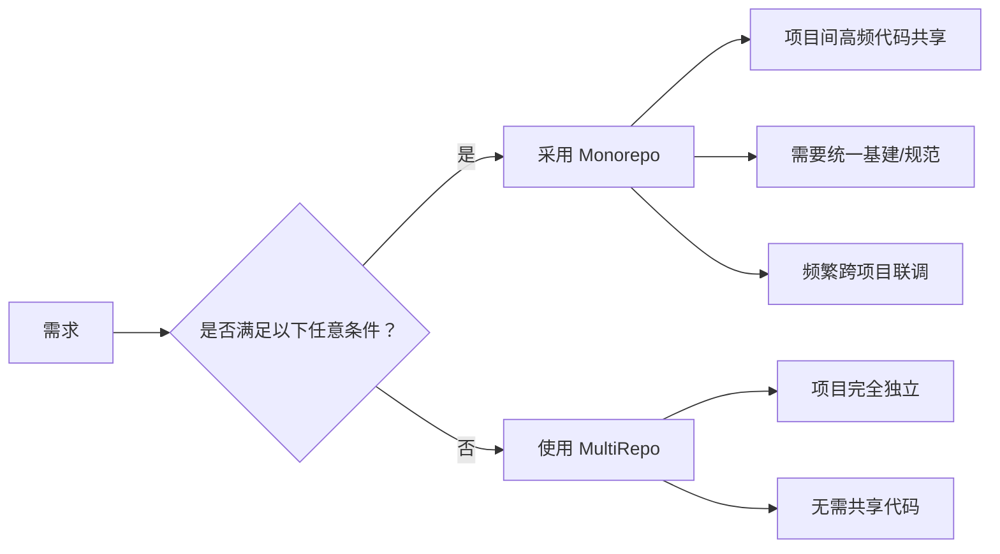
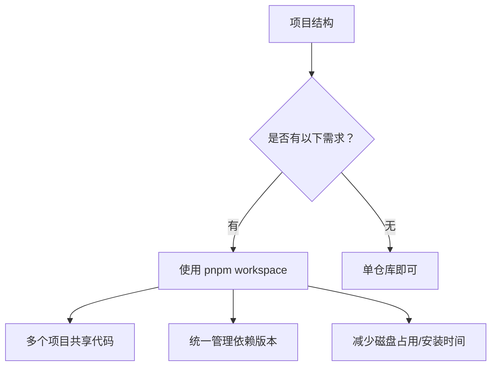
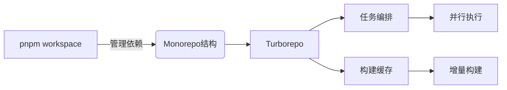

# 一. Monorepo
- **概念**：将多个相关项目（如前端应用、组件库、工具包）放在同一个代码仓库中管理
- **优势**：代码共享、统一基建、跨项目重构、依赖管理简化
- **问题**：项目增多后，构建效率可能下降

### 1. Monorepo 的核心特点
| **特性**          | **说明**                                                                 |
|--------------------|--------------------------------------------------------------------------|
| **统一存储**       | 所有项目代码位于同一仓库根目录下（如 `apps/`, `packages/` 子目录）         |
| **原子化提交**     | 一次提交可跨多个项目更新（如同时修改前端应用和共享组件库）                 |
| **依赖共享**       | 子项目可直接相互引用（如 `app1` 直接调用 `shared-ui` 组件库）              |
| **统一工具链**     | 全仓库共享构建、测试、代码规范等基建配置（ESLint、Jest、TypeScript 等）    |

---

### 2. Monorepo 工作流示例
```bash
my-monorepo/
├── apps/
│   ├── web-app/       # 前端应用
│   └── admin/         # 后台应用
├── packages/
│   ├── shared-ui/     # 公共组件库
│   └── utils/         # 工具函数库
├── package.json       # 根目录配置
└── pnpm-workspace.yaml # 声明工作区
```
- **依赖引用**：`web-app` 的 `package.json` 中直接引用本地包：
  ```json
  "dependencies": {
    "shared-ui": "workspace:*"  // 无需发布npm包即可联调
  }
  ```

---

### 3. 核心优势 vs 传统 MultiRepo
| **场景**               | **Monorepo**                            | **MultiRepo**                     |
|------------------------|-----------------------------------------|-----------------------------------|
| **跨项目修改**         | ✅ 原子提交，保证一致性                 | ❌ 需跨仓库同步，易遗漏           |
| **依赖版本管理**       | ✅ 所有项目使用相同依赖版本（避免冲突） | ❌ 各仓库依赖版本易碎片化         |
| **代码复用**           | ✅ 直接源码级引用                       | ❌ 需发布版本+安装，调试繁琐      |
| **统一基建**           | ✅ 一次配置，全仓库生效                 | ❌ 每个仓库重复配置               |
| **新人上手**           | ✅ `git clone` 后即可开发所有项目       | ❌ 需克隆多个仓库+配置环境        |

---

### 四、典型应用场景
1. **前端工程化**  
   - 主应用 + 微前端子应用 + 组件库 + CLI工具（如Vercel/Turborepo官方仓库）
2. **全栈项目**  
   - Web前端 + 移动端 + Node.js后端 + 公共类型定义（如Next.js示例项目）
3. **跨平台开发**  
   - iOS/Android/Web 共享核心业务逻辑（如React Native项目）
4. **大型开源项目**  
   - Babel、Jest、Vue3 等均采用 Monorepo 管理多包

---

### 5. 挑战与解决方案
| **挑战**                | **解决方案**                              |
|-------------------------|------------------------------------------|
| **仓库体积增长**        | 使用 `git sparse-checkout` 部分克隆      |
| **构建效率下降**        | 增量构建工具（Turborepo、Nx、Rush）      |
| **权限控制复杂**        | 目录级权限管理（Git Submodules 或 LFS）  |
| **IDE 性能压力**        | 限制索引范围（VS Code 的 `files.watcherExclude`） |

---

### 6、技术栈生态
- **包管理**：`pnpm workspace` > `Yarn workspace` > `Lerna`（已淘汰）
- **任务调度**：Turborepo（增量缓存）、Nx（分布式计算）、Rush（微软方案）
- **版本发布**：`changesets`（语义化版本自动化）、`lerna version`

---

### 7、何时选择 Monorepo？


> 💡 **数据支持**：根据 GitHub 统计，超 70% 的前端开源库使用 Monorepo 管理（2023），其工具链成熟度已可支撑中大型项目。

**总结**：Monorepo 是解决项目碎片化、提升协作效率的利器，但需配合现代化工具链（如 pnpm + Turborepo）才能发挥最大价值。


---

# 二、**pnpm workspace**
`pnpm workspace` 是 **pnpm 提供的 Monorepo 解决方案**，通过统一管理多个子项目的依赖和软链接，解决传统 Monorepo 的依赖冗余和效率问题。以下是其核心原理和使用详解：

---

### 1. 核心功能
| **功能**                | **解决的问题**                          | **传统方案对比**               |
|-------------------------|----------------------------------------|-------------------------------|
| **依赖提升**            | 避免重复安装相同依赖                   | `npm/yarn` 多副本占磁盘       |
| **工作区协议**          | 子项目直接引用本地源码                 | `npm link` 手动链接易出错     |
| **原子化安装**          | 全仓库依赖一次性安装                   | 各项目独立安装耗时            |
| **幽灵依赖防治**        | 严格限制访问未声明依赖                 | `npm/yarn` 易产生隐式依赖     |

---

### 2. 工作流程解析
#### 1. 初始化工作区
```bash
# 创建项目结构
my-monorepo/
├── package.json
├── pnpm-workspace.yaml  # 工作区声明文件
├── apps/
│   └── web/package.json
└── packages/
    └── shared/package.json
```

#### 2. 声明工作区 (`pnpm-workspace.yaml`)
```yaml
packages:
  - 'apps/*'       # 应用目录
  - 'packages/*'   # 共享包目录
```

#### 3. 子项目引用（示例：`apps/web/package.json`）
```json
{
  "dependencies": {
    "shared": "workspace:*",  // 关键！引用本地包
    "react": "^18.2.0"       // 公共依赖
  }
}
```

#### 4. 安装依赖（根目录执行）
```bash
pnpm install  # 一次性安装所有子项目依赖
```
**安装过程**：
1. 收集所有子项目依赖声明
2. 在根目录生成扁平化的 `node_modules`
3. 创建子项目依赖的符号链接

---

### 三、核心优势详解
#### 1. **依赖存储优化（内容寻址存储）**

- **效果**：100 个项目使用相同依赖，磁盘仅存 **1 份副本**（`npm/yarn` 存 100 份）
- **节省空间**：实测比 `npm` 减少 **70%+** 磁盘占用

#### 2. **工作区协议 (`workspace:`)**
```bash
# 自动链接本地包（无需 publish）
apps/web/node_modules/shared → packages/shared
```
- **开发阶段**：直接修改 `shared` 包实时生效
- **发布时**：自动替换为版本号（如 `"shared": "1.0.0"`）

#### 3. **严格依赖隔离**
```
node_modules
└── .pnpm
    ├── react@18.2.0
    └── shared@1.0.0 -> ../../packages/shared
```
- **禁止访问未声明依赖**：彻底解决 ”幽灵依赖“ 问题
- **依赖版本冲突**：允许不同子项目使用不同版本依赖

---

### 4. 常用命令
| **命令**                           | **作用**                             |
|------------------------------------|--------------------------------------|
| `pnpm install`                     | 安装全仓库依赖                       |
| `pnpm add -w lodash`               | 为根项目添加依赖 (`-w` 参数)         |
| `pnpm add react --filter web`      | 仅为 `web` 项目安装依赖              |
| `pnpm run --filter web build`      | 仅运行 `web` 项目的 build 脚本       |
| `pnpm update shared --recursive`   | 更新所有子项目的 `shared` 包版本     |

---

### 5. 典型问题解决方案
#### 问题 1：如何限制某依赖全仓库版本一致？
**方案**：在根目录 `package.json` 添加 `pnpm.overrides`
```json
{
  "pnpm": {
    "overrides": {
      "typescript": "5.0.0"  // 强制所有子项目使用 TS 5.0
    }
  }
}
```

#### 问题 2：如何仅发布变更的包？
**方案**：结合 `changesets` 工具：
1. 安装 `@changesets/cli`
2. 生成变更记录：
   ```bash
   pnpm changeset
   ```
3. 版本发布：
   ```bash
   pnpm changeset version
   pnpm publish -r --filter=.[publish]  # 仅发布有更新的包
   ```

---

### 6. 性能对比（以 React 生态项目为例）
| **操作**               | `npm`       | `Yarn workspace` | `pnpm workspace` |
|------------------------|-------------|-------------------|------------------|
| 首次安装时间           | 158s        | 92s               | **68s**          |
| 无变更重复安装         | 42s         | 28s               | **0.9s**         |
| 磁盘占用               | 1.7GB       | 1.3GB             | **0.4GB**        |
| `添加新依赖`速度       | 8s/项目     | 5s/项目           | **1.2s/全仓库**  |

> 测试环境：10 个子项目，MacBook Pro M1

---

### 7.何时使用 pnpm workspace？


**最佳实践**：  
- 前端微应用架构  
- 全栈项目（Web + Server + 公共库）  
- 组件库 + 文档站 + 示例项目  

通过配合 Turborepo 可实现 **依赖管理 + 高效构建** 的完整 Monorepo 解决方案。

---

### 三、 **Turborepo**
- **角色**：解决 Monorepo 的**构建效率问题**
- **核心能力**：
  - **任务编排**：智能识别任务依赖关系（拓扑排序）
  - **增量构建**：跳过未变更的项目
  - **分布式缓存**：复用历史构建结果
- **配置示例** (`turbo.json`)：
  ```json
  {
    "pipeline": {
      "build": {
        "dependsOn": ["^build"], // 先构建依赖项
        "outputs": ["dist/**"]
      },
      "test": {
        "dependsOn": ["build"],
        "outputs": []
      }
    }
  }
  ```

---

### 4. **技术栈协同原理**


1. **依赖安装**  
   `pnpm install` → 创建优化的依赖树

2. **执行构建**  
   `turbo run build` → 
   - 扫描所有子项目的 `package.json` 中的 `build` 脚本
   - 根据依赖关系确定构建顺序
   - 检查文件哈希决定是否跳过构建

3. **缓存机制**  
     
   (图片来源：Turborepo 官网)

---

### 5. **完整工作流示例**
```bash
# 1. 安装依赖（整个仓库执行一次）
pnpm install

# 2. 执行所有子项目的构建（自动应用缓存）
npx turbo run build

# 3. 只构建某应用及其依赖
npx turbo run build --filter=my-app
```

---

### 6. **核心收益**
| 能力                | 工具           | 效果                             |
|---------------------|---------------|----------------------------------|
| 依赖管理            | pnpm workspace | ⬇️ 安装时间减少 50%+，磁盘节省 70%+ |
| 增量构建            | Turborepo     | ⚡ 构建速度提升 85%+              |
| 远程缓存            | Turborepo     | 🌩 新机器/CI 环境免重复构建        |
| 任务并行            | Turborepo     | ⚡ 最大化利用多核 CPU             |
| 依赖拓扑排序        | Turborepo     | 🔗 确保构建顺序正确               |

---

### 7. **适用场景**
- 大型前端项目群（如：主站 + 后台 + 组件库）
- 多产品线共享代码库
- 微前端基座+子应用开发
- Node.js 后端服务集群

> 💡 **统计数据**：使用该方案的项目通常获得 **10 倍以上** 的本地开发效率提升（来源：Turborepo 官方基准测试）

这种方案已成为现代前端 Monorepo 的**事实标准**，被 Vercel、AWS、Shopify 等公司广泛采用。


----
---
https://baidu.github.io/amis/zh-CN/docs/index