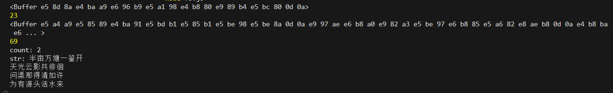

# fs
>fs全称为 file system ,文件系统模块是Node.js中的核心模块之一，用于文件的读取、写入、复制、删除等操作，同时也支持目录的创建、遍历和修改等操作。使用fs模块，你可以在Node.js环境中轻松地与文件系统交互。  
### 文件写入
#### 1.writeFile	异步写入
  ```fs.writeFile(file, data[, options], callback)```
  + file - 要写入的文件路径,如果该路径不存在，会创建一个新的文件，如果该路径存在，则会被覆盖
  + data - 要写入的数据
  + options - 可选参数，可以是一个字符串或对象，默认为utf8编码
  + callback - 回调函数
  
 例子：
  ```
  const fs = require('fs')

  fs.writeFile(`./fs.md`, 'Hello fileSystem', 'utf-8', (err) => {
    console.log(err)
  })
  ``` 
#### 2.writeFileSync	同步写入
   ```fs.writeFileSync(file, data[, options])```
   + file - 要写入的文件路径,如果该路径不存在，会创建一个新的文件，如果该路径存在，则会被覆盖
   + data - 要写入的数据
   + options - 可选参数，可以是一个字符串或对象，默认为utf8编码
  
  例子：
  ```
  try {
    fs.writeFileSync('./fs.md', 'Hello fileSystem', 'utf-8')
  } catch (err) {
    console.log(err)
  }
  ```
#### 3.appendFile / appendFileSync	追加写入
>writeFile/writeFileSync可以将数据写入一个文件, 如果文件已经存在则会被替换,而追加写入则不会覆盖原文件

 ```fs.appendFile(file, data[, options], callback)```
 ```fs.appendFileSync(file, data[, options])```
#### 4.createWriteStream	流式写入
>createWriteStream方法返回一个可写流，你可以通过write方法写入数据，然后通过end方法结束写入。流式写入适用于大文件写入和频繁写入。
```fs.createWriteStream(path[, options])```
+ path - 要写入的文件路径
+ options - 可选参数，可以是一个字符串或对象，默认为utf8编码
```
let ws = fs.createWriteStream('./观书有感.txt', {
  flags: 'w',//指定用什么模式打开文件，’w’代表写，’r’代表读，类似的还有’r+’、’w+’、’a’等
  encoding: 'utf8',//指定打开文件时使用编码格式，默认就是“utf8”，你还可以为它指定”ascii”或”base64”
  fd: null,//fd属性默认为null，当你指定了这个属性时，createReadableStream会根据传入的fd创建一个流，忽略path。另外你要是想读取一个文件的特定区域，可以配置start、end属性，指定起始和结束（包含在内）的字节偏移
  mode: 0666,//通常不建议修改
  autoClose: true//autoClose属性为true（默认行为）时，当发生错误或文件读取结束时会自动关闭文件描述符
});

ws.write('半亩方塘一鉴开\r\n');
ws.write('天光云影共徘徊\r\n');
ws.write('问渠那得清如许\r\n');
ws.write('为有源头活水来\r\n');

ws.end();
```

### 文件读取
#### 1.readFile	异步读取
```fs.readFile(path[, options], callback)```
+ path - 要读取的文件路径
+ options - 可选参数，可以是一个字符串或对象，默认为utf8编码
+ callback - 回调函数

例子：
```
const fs = require('fs')
fs.readFile('./fs.md', 'utf-8', (err, data) => {
  console.log(err, data)
  if (err) {
    console.log(err)
    return
  }
})
```
#### 2.readFileSync	同步读取
> 同步地读取文件的内容。它会阻塞程序的执行，直到文件读取完成

```fs.readFileSync(path[, options])```
   + path - 要读取的文件路径
   + options - 可选参数，可以是一个字符串或对象，默认为utf8编码

例子：
```
try {
  fs.readFileSync('./fs.md', 'utf-8')
} catch(err) {
  console.log(err)
}
<!-- 读取一个文件，写入另一个文件 -->
fs.writeFile(`./test2`,  fs.readFileSync('./test', 'utf-8'), 'utf-8', (err) => {
  console.log(err)
})
```
#### 3.createReadStream	流式读取
>createReadStream方法返回一个可读流，你可以通过read方法读取数据，然后通过end方法结束读取。流式读取适用于大文件读取和频繁读取。
```fs.createReadStream(path[, options])```
+ path - 要读取的文件路径
+ options - 可选参数，可以是一个字符串或对象，默认为utf8编码
例子：
```
//创建读取流对象
let rs = fs.createReadStream('./test');

let count = 0;
let str = ""
//每次取出 64k 数据后执行一次 data 回调
rs.on('data', data => {
  str += data;
  count++
  console.log(data);
  console.log(data.length);
});

//读取完毕后, 执行 end 回调
rs.on('end', () => {
  console.log("count:", count)
  console.log("str:", str)
  console.log('读取完成')
})

rs.on('error', err => {
    console.log(err)
})
```

  
#### 4.读取文件目录
```fs.readdir(path[, options], callback)```
```fs.readdirSync(path[, options])```
+ path - 要读取的文件路径
+ options - 可选参数，可以是一个字符串或对象，默认为utf8编码
+ callback - 回调函数

例子：
```
fs.readdir('../vue3', (err, files) => {
  if (err) throw err;
  console.log('目录中的文件列表:', files); // 目录中的文件列表: [ '01.md', 'bus.md', 'hooks.md' ]
});
```
### 文件创建/移动/复制/删除
#### 1.创建文件目录 mkdir / mkdirSync
```fs.mkdir(path[, options], callback)```
```fs.mkdirSync(path[, options])```
+ path - 要创建的目录路径
+ options - 可选参数，可以是一个字符串或对象，默认为utf8编码
+ callback - 回调函数

例子
```
//异步创建文件夹
fs.mkdir('./page', err => {
  if(err) throw err;
  console.log('创建成功');
});

//递归异步创建
// recursive 递归的
fs.mkdir('./1/2/3', {recursive: true}, err => {
  if(err) throw err;
  console.log('递归创建成功');
});

//递归同步创建文件夹
fs.mkdirSync('./x/y/z', {recursive: true});
```

#### 2.移动rename / renameSync
```fs.rename(oldPath, newPath, callback)```
```fs.renameSync(oldPath, newPath)```
+ oldPath - 要移动的文件或文件夹路径
+ newPath - 要移动到的新路径
+ callback - 回调函数

例子：
```
fs.rename('./test', './testCopy', (err) => {
  console.log(err)
})
```
#### 3.复制copyFile / copyFileSync
```fs.copyFile(src, dest[, flags], callback)```
```fs.copyFileSync(src, dest[, flags])```
+ src - 要复制的文件路径
+ dest - 要复制到的新路径
+ flags - 可选参数，可以是一个字符串或对象，默认为utf8编码
+ callback - 回调函数

例子：
```
fs.copyFile('./test2', './testCopy', (err) => {
  console.log(err)
})
```
#### 4.删除文件目录 rmdir / rmdirSync
```fs.rmdir(path[, options], callback)```
```fs.rmdirSync(path[, options])```
+ path - 要删除的目录路径
+ options - 可选参数，可以是一个字符串或对象，默认为utf8编码
+ callback - 回调函数
>删除目录需要 确认目录 ./1/2/3 确实存在，并且是空的，如果不为空，需要先删除目录中的所有文件和子目录。
如果目录中有文件或其他目录，可以使用 fs.rmdir 或 fs.rmdirSync 配合递归删除文件和子目录的方法。
```
fs.rmdir('./1/2/3', (err) => {
  console.log(err)
})
```
#### 5.删除文件 unlink / unlinkSync
```fs.unlink(path, callback)```
```fs.unlinkSync(path)```
+ path - 要删除的文件路径
+ callback - 回调函数

```fs.unlinkSync('./dele.js')```

递归地删除指定的目录及其所有内容： 

```
const fs = require('fs')
const path = require('path');

function deleteDirectoryRecursive(directoryPath) {
  if (fs.existsSync(directoryPath)) {
    // readdirSync 读取当前目录下所有文件和文件夹
    fs.readdirSync(directoryPath).forEach(function(file, index) {
      var curPath = path.join(directoryPath, file);
      /**
       * fs.lstatSync方法，它返回一个fs.Stats对象，该对象包含了关于给定文件或符号链接的信息，
       * 该对象的isDirectory()方法，它会检查返回的文件信息并返回一个布尔值，
       * 表明给定的路径是否是一个目录。
       */
      if (fs.lstatSync(curPath).isDirectory()) { // 如果是目录，递归删除子目录
        deleteDirectoryRecursive(curPath);
      } else { // 不是目录，直接删除该文件
        fs.unlinkSync(curPath);
      }
    });
    fs.rmdirSync(directoryPath);
  }
}
```
http://cw.hubwiz.com/card/c/5359f6f6ec7452081a7873d8/1/3/5/


# fs-extra
> fs-extra 是 替代 Node.js 内置 fs 模块，更安全、更强大的文件操作库，它大多数方法默认为异步，如果未传递回调，则所有异步方法将返回一个promise

#### 快速上手
```
npm install fs-extra
const fs = require('fs-extra')
```
#### [官方文档](https://github.com/jprichardson/node-fs-extra)