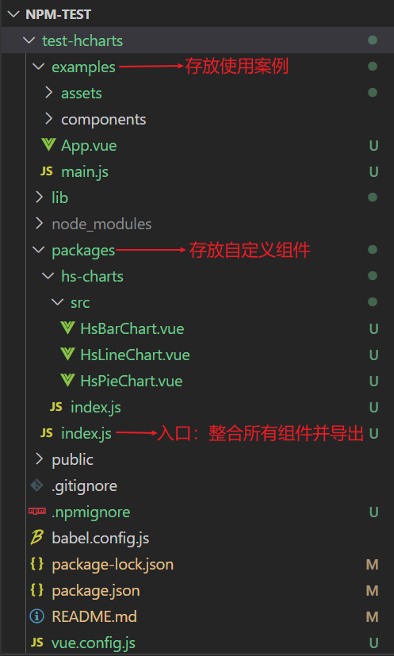
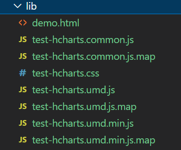
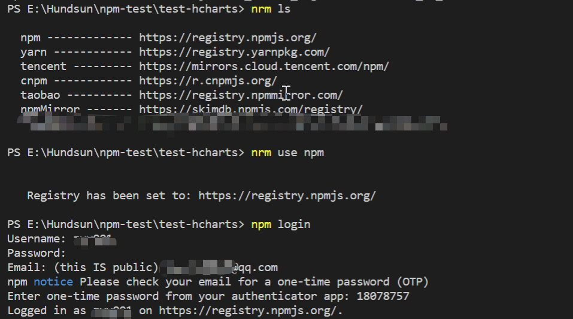
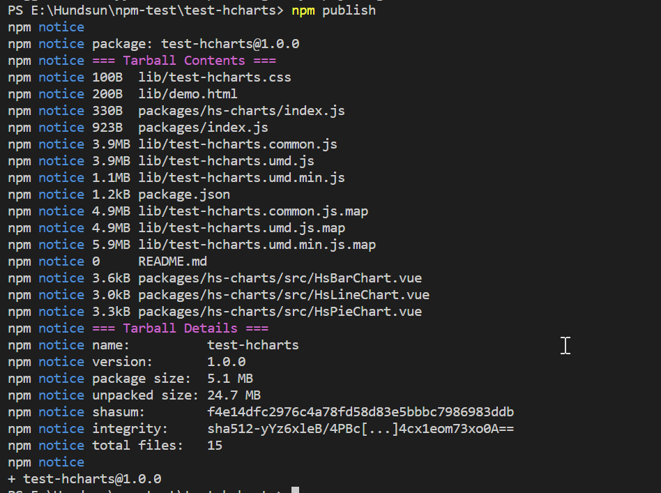

## 如何发布自己的npm组件包
&nbsp;&nbsp;&nbsp;&nbsp;&nbsp;&nbsp;&nbsp;&nbsp;&nbsp;&nbsp;&nbsp;&nbsp;&nbsp;&nbsp;&nbsp;&nbsp;&nbsp;&nbsp;&nbsp;&nbsp;&nbsp;&nbsp;&nbsp;&nbsp;&nbsp;&nbsp;&nbsp;&nbsp;&nbsp;&nbsp;&nbsp;&nbsp;&nbsp;&nbsp;&nbsp;&nbsp;&nbsp;&nbsp;&nbsp;&nbsp;&nbsp;&nbsp;&nbsp;**—— 以vue3封装echarts组件为例**
#### 1.创建项目
```
vue create test-hcharts
```
#### 2.修改项目目录
- 原本的 src 文件夹修改为 examples，用于存放使用组件的案例；  
- 新增 packages 文件夹，用于存放封装的自定义组件
- 新增vue.config.js文件，用于修改相关的配置
  
#### 3.书写组件
这里以发布封装echarts组件为例， packages 文件夹下，新建 hs-charts > src 文件夹，src 用于存放所有的vue组件。  
这里需要注意的是，一定要将组件的name属性export出去，因为我们是通过name属性对组件进行注册的。
```
<template>
  <div :style="{ width: '100%', height: '100%' }" ref="chartDom"></div>
</template>

<script>
export default {
  name: 'HsBarChart',
}
</script>
<script setup>
import {
  ref,
  onMounted,
  onBeforeUnmount,
  defineProps,
  watch,
  reactive,
} from 'vue'
import * as echarts from 'echarts'
import merge from 'deepmerge'

const chartDom = ref()
let myChart = null

<!-- 接受父组件的数据 -->
const props = defineProps({
  option: Object,
  data: {
    columns: [],
    rows: [],
  },
})

const data = reactive({
  xData:[],
  series:[]
})

<!-- 下面是针对特定场景对数据进行处理 -->
// 横坐标
const keyName = computed(() => {
  return props.data.columns[0]
})
watch(() => props.data.rows, (rows) => {
  data.xData = rows.map(e=>e[keyName.value])
}, {
  immediate: true,
  deep: true
})

// series
for (let i = 1; i < props.data.columns.length; i++) {
  data.series[i - 1] = {
    name: props.data.columns[i],
    type: 'bar',
    emphasis: {
      focus: 'series',
    },
    data: [],
  }
  props.data.rows.map((item) => {
    // console.log("+++", item[chartData.columns[i]]);
    data.series[i - 1].data.push(item[props.data.columns[i]])
  })
}

<!-- 这里是所封装组件的默认配置项，参考echarts官方文档 -->
const defalutOption = reactive({
  color: [
    '#1890FF',
    '#13C2C2',
    '#2EC25B',
    '#FACC14',
    '#EF4864',
    '#8543E0',
    '#d87a80',
    '#9cbbff',
    '#d9d0c7',
    '#87a997',
    '#d49ea2',
    '#5b4947',
    '#1890FF',
  ],
  tooltip: {
    trigger: 'axis',
    backgroundColor: 'rgba(111, 111, 111, 0.9)',
    borderColor: 'rgba(111, 111, 111, 0.9)',
    axisPointer: {
      type: 'none',
    },
    textStyle: {
      color: '#fff',
    },
  },
  emphasis: {
    disabled: true,
  },
  legend: {},
  grid: {
    left: '3%',
    right: '4%',
    bottom: '3%',
    containLabel: true,
  },
  yAxis: [
    {
      type: 'value',
    },
  ],
  xAxis: [
    {
      type: 'category',
      data: xData,
    },
  ],
  series: series,
})

<!-- 合并父组件传过来的数据与配置项 -->
let option = reactive(merge(defalutOption, props.option || {}))

//重绘图表函数
const resizeHandler = () => {
  console.log('重会  ')
  myChart.resize()
}

// 这里选择关闭节流操作
const debounce = (fn, delay) => {
  let timer = null 
  return function () {
    if (timer) {
      clearTimeout(timer)
    }
    timer = setTimeout(() => {
      fn.call(this)
    }, delay)
  }
}
const cancalDebounce = debounce(resizeHandler, 0)

<!-- 初始化图表 -->
onMounted(() => {
  //配置为 svg 形式，预防页面缩放而出现模糊问题；图表过于复杂时建议使用 Canvas
  myChart = echarts.init(chartDom.value, null, { renderer: 'svg' })
  console.log('chartDom.value', chartDom.value)
  myChart.setOption(option, true)
  //自适应不同屏幕时改变图表尺寸
  window.addEventListener('resize', cancalDebounce)
})

onBeforeUnmount(() => {
  window.removeEventListener('resize', cancalDebounce)
  myChart.dispose()
})

// 监听option，改变时重新渲染
watch(
  () => option,
  () => {
    myChart.setOption(option, true)
  },
  { deep: true }
)
</script>

<style scoped>
.barChart {
  width: 100%;
  height: 100%;
}
</style>

```
### 4.在mian.js中引入封装的组件,注册并导出
```
// 整合所有的组件并导出
import HsBarChart from './hs-charts/src/HsBarChart.vue'
import HsLineChart from './hs-charts/src/HsLineChart.vue'
import HsPieChart from './hs-charts/src/HsPieChart.vue'

// 组件列表
const components = [HsBarChart, HsLineChart, HsPieChart]

// 定义 install 方法，接收 Vue 作为参数。如果使用 use 注册插件，则所有的组件都将被注册
const install = function (Vue) {
  // 判断是否安装
  if (install.installed) return
  // 遍历注册全局组件
  components.map((component) => Vue.component(component.name, component))
}

// 判断是否是直接引入文件
if (typeof window !== 'undefined' && window.Vue) {
  install(window.Vue)
}

export default {
  // 导出的对象必须具有 install，才能被 app.use() 方法安装
  install,
  // 以下是具体的组件列表
  HsBarChart,
  HsLineChart,
  HsPieChart,
}

```
> app.use(myPlugin, {})
>   -安装一个插件
>      该插件可以是一个拥有 install() 方法的对象，也可以直接是一个安装函数本身。
>      插件选项 (app.use() 的第二个参数) 将会传递给插件的 install() 方法


### 5.在新建的vue.config.js中修改默认的配置  
由于默认的入口为 src，我们将 src 改为了 examples，这里也要进行相应的修改。
```
const path = require('path')

module.exports = {
  // 修改默认的入口
  pages: {
    index: {
      entry: 'examples/main.js',
      template: 'public/index.html',
      filename: 'index.html',
    },
  },
  chainWebpack: (config) => {
    // vue默认@指向src目录，这里要修正为examples，另外新增一个~指向packages
    config.resolve.alias
      .set('@', path.resolve('examples'))
      .set('~', path.resolve('packages'))
    // lib目录是组件库最终打包好存放的地方，不需要eslint检查
    // examples/docs是存放md文档的地方，也不需要eslint检查
    config.module
      .rule('eslint')
      .exclude.add(path.resolve('lib'))
      .end()
      .exclude.add(path.resolve('examples/docs'))
      .end()
    // packages和examples目录需要加入编译
    config.module
      .rule('js')
      .include.add(/packages/)
      .end()
      .include.add(/examples/)
      .end()
      .use('babel')
      .loader('babel-loader')
      .tap((options) => {
        // 修改它的选项...
        return options
      })
  },
}

```
### 6.在package.json中，配置lib编译命令和相关属性
配置最终打的lib包的名称（test-hcharts），以及入口（packages/index.js）
```
  "name": "test-hcharts",
  "version": "1.0.0", 
  "private": false,
  "main": "lib/test-hcharts.common.js",
  "keywords": [
    "test-hcharts"
  ],
  "author": {
    "name": "zyy"
  },
  "description": "基于echarts对堆叠柱状图、堆叠折线图、饼图进行二次封装",
  "scripts": {
    "lib": "vue-cli-service build --target lib --name test-hcharts --dest lib packages/index.js"
  },
```
### 7.添加 .npmignore 文件，设置忽略发布文件
```
#忽略目录
public/
examples/
#忽略制定文件
vue.config.js
babel.config.js
```
### 8.打包并发布
- 以上全部完成后，执行 ```npm run lib``` 将封装的组件最终打为lib包，打完的目录如下：  
  

- ```nrm use npm``` 将源切换至npm
- ```npm login``` 登录npm账号
- ```npm publish``` 发布到npm



### 9.下载并使用
```
首先
npm install test-hcharts

然后在main.js中引入
import { createApp } from 'vue'
import App from './App.vue'
import test-hcharts from 'test-hcharts'
createApp(App).use(test-hcharts).mount('#app')

最后在vue页面直接使用所封装的组件即可
<HsBarChart :data="chartData"></HsBarChart>
```
