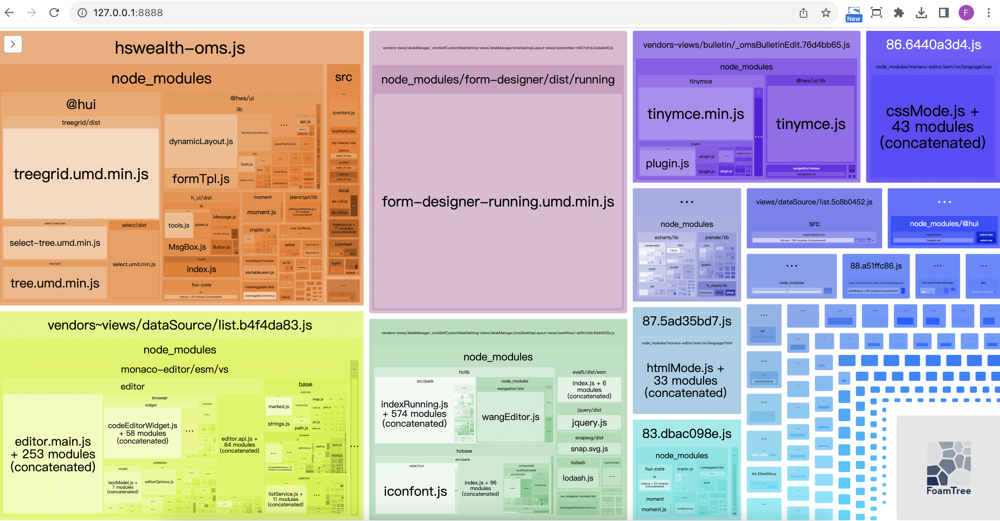

### 打包优化

优化一：打包后的结果，上线时的性能优化。（比如分包处理、减小包体积、CDN服务器等）
优化二：优化打包速度，开发或者构建时优化打包速度。（比如exclude、cache-loader等）
大多数情况下，我们会更加侧重于优化一，这对于线上的产品影响更大。
在大多数情况下webpack都帮我们做好了该有的性能优化：
比如配置mode为production或者development时，默认webpack的配置信息, 但是我们也可以针对性的进行自己的项目优化，我们来看下未优化前的oms-web包分析，我们将hui.config.js文件下analyze打开。借助webpack-bundle-analyzer 来分析下包内容，它是 webpack 的一个插件，将打包文件可视化展现，生成代码分析报告，可以直观地分析打包出的文件有哪些，及它们的大小、占比情况、各文件 Gzipped 后的大小、模块包含关系、依赖项等，对应做出优化，从而帮助提升代码质量和网站性能

优化前：

我们可以看未优化前的整包大小为15.72MB，同时首次加载的hswealth-oms.js 为 3.36MB, 下面是网络加载时序图


从上图中，我们可以看到hswealth-oms的整体文件较大，我们进行拆分，里面包含了一些非首次加载必须的依赖，比如@hui/treegrid、1.0低码资源等


分析：
将大的包进行拆分，一些页面用到的大组件放到页面中，不放在index中加载（提升首屏性能）


#### Webpack的代码分割配置：

```
configWp.optimization.splitChunks = {
  chunks: 'all', // 指定对哪些类型的chunks应用代码分割，可选值有 'async' (默认)、'initial' 或 'all'
  cacheGroups: {
    vendors: { // 第三方库分离
      test: /[\\/]node_modules[\\/]/,
      priority: -10, // 优先级，数值越大优先级越高
      filename: 'vendors.js', // 输出文件名
      reuseExistingChunk: true, // 如果一个模块已经在主 chunk 里，就直接使用，不会重新生成
    },
    defaultVendors: { // 默认的第三方库分离
      priority: -20,
      test: /[\\/]node_modules[\\/]/,
      reuseExistingChunk: true,
    },
    default: { // 默认分离
      minChunks: 2, // 至少被两个chunks共享才会被打包到同一chunk
      priority: -20,
      reuseExistingChunk: true,
    }
  }
};
```
>```vendors```：这个缓存组主要用于将项目中用到的所有第三方库（位于 node_modules 中的模块）打包到单独的 vendors.js 文件中。
```defaultVendors```：与 ```vendors``` 类似，但是优先级较低，可以用来处理一些特殊情况。
```default```：当模块不匹配任何其他缓存组时，默认的缓存组会起作用，这里设置了至少被两个 chunks 共享的模块才会被打包到同一个 chunk 中。
通过这种方式，你可以更好地控制Webpack如何分割代码，并且有助于提升应用的加载性能。

#### webpack使用 TerserPlugin 进行JavaScript代码压缩
```
configWp.optimization.minimizer = [
  new TerserPlugin({
    terserOptions: {
      compress: {
        arrows: false,
        collapse_vars: false,
        comparisons: false,
        computed_props: false,
        hoist_funs: false,
        hoist_props: false,
        hoist_vars: false,
        inline: false,
        loops: false,
        negate_iife: false,
        properties: false,
        reduce_funcs: false,
        reduce_vars: false,
        switches: false,
        toplevel: false,
        typeofs: false,
        booleans: true,
        if_return: true,
        sequences: true,
        unused: true,
        conditionals: true,
        dead_code: true,
        evaluate: true,
        drop_console: true, //  移除所有 console 调用。
        drop_debugger: true, // 移除所有 debugger 语句。
        pure_funcs: ['console.log'] // 将 console.log 视为纯函数，即在某些情况下可以安全地移除。
      },
      mangle: {
        safari10: true // 使变量名称在Safari 10中兼容
      }
    },
    sourceMap: false, // 不生成源映射文件
    cache: true, // 启用缓存以加速构建过程
    parallel: 3, // 表示并发运行3个线程进行压缩
    extractComments: false, // 不提取注释
    exclude: [ // 以下文件不进行压缩
      'sysconfig.js',
      /static/
    ]
  })
];
```
>源映射文件（Source Map）是一种机制，它允许你在压缩后的代码中调试**原始的未压缩代码**。这对于开发和调试阶段非常有用，因为压缩后的代码通常难以阅读和调试。