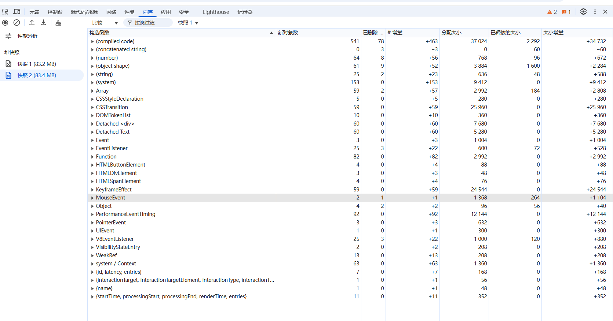

关于堆快照中的构造函数：



### **1. 核心构造函数**
#### **(1) `Object`**
- **含义**：普通 JavaScript 对象，通过 `{}` 或 `new Object()` 创建。
- **泄漏场景**：
  - 全局变量或缓存中存储大量未清理的对象。
  - 闭包中意外持有对大对象的引用。
- **排查建议**：
  - 检查代码中是否有全局对象或缓存未及时清理。
  - 使用 **Retainers** 查看对象的引用链。

#### **(2) `Array`**
- **含义**：JavaScript 数组，通过 `[]` 或 `new Array()` 创建。
- **泄漏场景**：
  - 全局数组持续增长，未及时清空（如日志记录、缓存数据）。
  - 保存已移除的 DOM 节点引用（导致 `Detached` 节点）。
- **排查建议**：
  - 检查全局数组的生命周期，确保不再需要时清空（`array = []`）。

#### **(3) `Closure`**
- **含义**：JavaScript 闭包，通常是函数作用域中保留的变量。
- **泄漏场景**：
  - 闭包中引用外部变量，导致变量无法释放（如事件监听器未移除）。
- **排查建议**：
  - 检查闭包中是否持有对大对象或 DOM 的引用。
  - 使用 **Retainers** 查看闭包引用的外部变量。

---

### **2. DOM 相关构造函数**
#### **(1) `HTMLDivElement`、`HTMLSpanElement` 等**
- **含义**：具体的 DOM 元素类型，如 `<div>`、`<span>`。
- **泄漏场景**：
  - DOM 元素已从页面移除，但仍被 JavaScript 变量引用（`Detached` 节点）。
- **排查建议**：
  - 在堆快照中搜索 `Detached`，找到未释放的 DOM 节点。
  - 检查代码中是否有全局变量或数组持有这些节点。

#### **(2) `EventTarget`**
- **含义**：DOM 事件目标对象，所有可触发事件的 DOM 元素均继承自此类。
- **泄漏场景**：
  - 未移除的事件监听器导致 DOM 元素无法释放。
- **排查建议**：
  - 检查 `addEventListener` 是否对应 `removeEventListener`。

#### **(3) `DOMStringMap`**
- **含义**：DOM 元素的 `dataset` 属性（如 `element.dataset`）。
- **泄漏场景**：
  - 通过 `dataset` 存储大量数据，未及时清理。
- **排查建议**：
  - 避免在 `dataset` 中存储大对象。

#### **(4) `Detached <div>`（已分离的 DOM 元素）**
- **含义**：  
  指已经从 DOM 树中移除（通过 `removeChild` 或 `innerHTML` 清空），但仍被 JavaScript 变量引用的 DOM 元素。这类元素无法被垃圾回收，是**最常见的内存泄漏原因**。
- **常见场景**：  
  代码中保留了已移除 DOM 元素的引用，例如：
  ```javascript
  let detachedDiv = document.createElement('div');
  document.body.appendChild(detachedDiv);
  document.body.removeChild(detachedDiv); // DOM 已移除
  // 但 detachedDiv 变量仍引用该元素 → 内存泄漏！
  ```
- **排查建议**：  
  1. 在堆快照中搜索 `Detached`，找到泄漏的 DOM 节点。  
  2. 检查代码中是否全局变量、数组、闭包等仍持有这些节点的引用。  
  3. 修复方法：在移除 DOM 后，清除对其的引用（如 `detachedDiv = null`）。
---

### **3. 浏览器内部构造函数**
#### **(1) `system / Context`**
- **含义**：浏览器上下文对象，如 `iframe`、`Web Worker` 的上下文。
- **泄漏场景**：
  - 未销毁的 `iframe` 或 `Worker`。
- **排查建议**：
  - 调用 `iframe.remove()` 或 `worker.terminate()`。

#### **(2) `PerformanceEventTiming`**
- **含义**：  
  浏览器为记录用户交互事件（如点击、滚动）的性能数据（如事件触发时间、处理时长）而创建的对象。属于浏览器内部实现的一部分。
- **常见场景**：  
  正常现象，但**如果有大量未释放的 `PerformanceEventTiming` 对象，可能是浏览器事件监听未正确清理。**
- **排查建议**：  
  检查代码中是否有未移除的 `event listener`，尤其是高频事件（如 `scroll`、`mousemove`）。

#### **(3) `compiled code`**
- **含义**：  
  指 JavaScript 引擎（如 V8）将 JavaScript 代码编译为机器码后生成的代码缓存。例如，频繁执行的函数会被优化并缓存以提高性能。
- **常见场景**：  
  正常现象，但如果 `compiled code` 异常增长，可能是由于代码频繁动态编译（如 `eval` 或动态生成函数）。
- **排查建议**：  
  通常无需处理，除非代码中存在大量动态脚本生成逻辑。

#### **(4) `system`**
- **含义**：  
  表示浏览器内部进程或底层系统占用的内存，例如网络缓存、GPU 内存、浏览器自身进程等。这部分内存不由 JavaScript 代码直接管理。
- **常见场景**：  
  正常现象，但如果 `system` 内存异常增长，可能是浏览器本身的问题，或页面行为间接导致（如大量网络请求未释放）。
- **排查建议**：  
  通常无需开发者干预，但可尝试关闭页面后观察内存是否释放。

---

### **4. 其他常见构造函数**
#### **(1) `Function`**
- **含义**：JavaScript 函数对象。
- **泄漏场景**：
  - 动态生成的函数未释放（如定时器回调）。
- **排查建议**：
  - 清理不再需要的定时器（`clearTimeout`/`clearInterval`）。

#### **(2) `Map`、`Set`、`WeakMap`、`WeakSet`**
- **含义**：ES6 数据结构。
- **泄漏场景**：
  - `Map`/`Set` 中存储大量未清理的引用。
- **排查建议**：
  - 优先使用 `WeakMap`/`WeakSet` 避免强引用。

#### **(3) `Promise`**
- **含义**：JavaScript Promise 对象。
- **泄漏场景**：
  - 未解决的 Promise 链导致引用无法释放。
- **排查建议**：
  - 确保 Promise 链有终止条件（如 `catch`/`finally`）。

---

### **如何利用构造函数排查内存泄漏？**
1. **按构造函数过滤**：
   - 在堆快照中，点击 **Constructor** 列排序，查看哪种类型的对象数量异常。
   - 重点关注 `Detached` 节点、`Closure`、`Array` 等。

2. **比较快照**：
   - 拍摄操作前后的堆快照，切换到 **Comparison** 模式。
   - 观察特定构造函数（如 `HTMLDivElement`）的实例数是否持续增长。

3. **分析引用链**：
   - 选中目标对象，查看 **Retainers** 面板中的引用链。
   - 定位到代码中持有引用的变量（如全局对象、闭包）。

---

### **示例：排查 `Detached HTMLDivElement` 泄漏**
1. **堆快照中搜索 `Detached`**：
   - 发现多个 `Detached HTMLDivElement` 实例。

2. **查看引用链**：
   - 发现这些节点被一个全局数组 `leakedNodes` 引用。

3. **修复代码**：
   ```javascript
   // 错误代码：未清空数组
   const leakedNodes = [];
   function createLeak() {
     const div = document.createElement('div');
     document.body.appendChild(div);
     leakedNodes.push(div);
   }
   function clearLeak() {
     leakedNodes.forEach(div => div.remove());
     // 修复：清空数组
     leakedNodes.length = 0;
   }
   ```

---

通过理解构造函数类型及其泄漏场景，可以快速定位内存泄漏的根本原因！