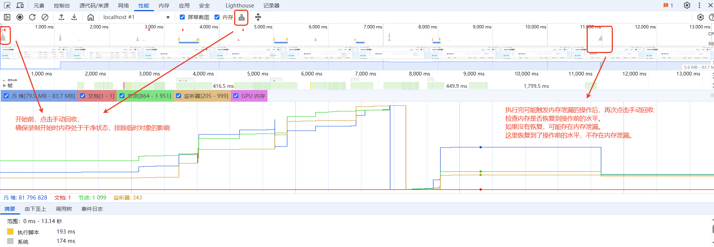

## 1、性能面板
+ 勾选内存
+ 开始前，手动点击垃圾回收，确保录制开始前内存处于干净状态，排除临时对象的影响；
+ 多次执行可能触发内存泄漏的操作，再次点击垃圾回收
+ 检查内存是否恢复到操作前的水平

可能存在内存泄漏：

## 2、切换到内存面板
### 2.1 堆快照
+ 点击垃圾回收，拍摄初始状态下的堆快照

+ 多次执行可能触发内存泄漏的操作
<!-- + 再次点击垃圾回收，拍摄结束状态下的堆快照 -->
+ 点击对比快照，查看两次快照的差异

根据两张堆快照的对比，可以看到 增量内存最大的是 Detached Div和 Detached Text

通过引用链，可以进一步看到, 是由于名为 detachedNodes 的数组导致的，然后针对这个数组进行排查即可。

> [关于堆快照中的构造函数](./名词.md)

### 2.2 时间轴上的分配情况
+ 选择 时间轴上的分配情况（ Allocation instrumentation on timeline）
+ 点击 Start 按钮开始录制。
+ 在页面上执行可能导致内存泄漏的操作（如打开/关闭弹窗、切换路由等）。
+ 停止录制
+ 分析时间轴上的内存分配
+ 定位内存泄漏的具体位置在时间轴上，找到内存分配频繁的区域（蓝色条密集的地方）。
+ 点击某个蓝色条，查看该时间段内分配的对象
+ 选中某个对象，查看其分配位置
> **时间轴视图**：
> 时间轴会显示内存分配的情况，横轴是时间，纵轴是内存使用量。
> 蓝色条：表示新分配的内存。
> 灰色条：表示已释放的内存。
> **重点关注**：
> 蓝色条持续增加：表示内存分配频繁且未释放。
> 灰色条较少：表示内存释放不足，可能存在内存泄漏。

### 2.3 分配采样
+ 选择 分配采样（Allocation sampling）
+ 点击 Start 按钮开始录制。
+ 在页面上执行可能导致内存泄漏的操作（如打开/关闭弹窗、切换路由等）。
+ 停止录制
+ 查找高分配量的函数，定位到具体代码位置
  

### 2.4 已分离的元素
Memory 面板中，已分离的元素（Detached Elements） 是排查内存泄漏的重要线索。已分离的元素是指已经从 DOM 树中移除，但仍然被 JavaScript 代码引用的 DOM 节点。这些节点无法被垃圾回收，从而导致内存泄漏。

